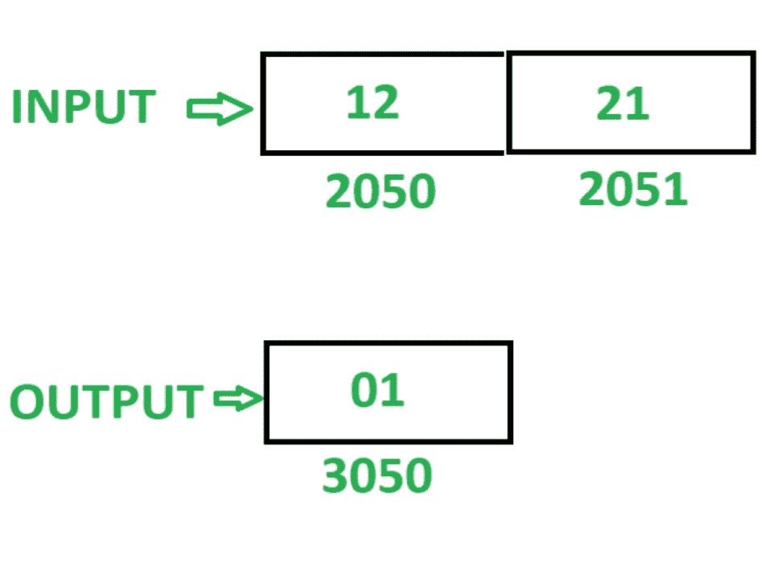
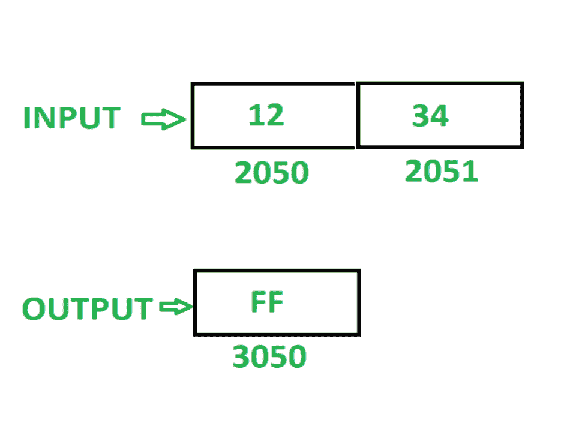

# 8085 程序检查给定的 16 位数字是否回文

> 原文: [https://www.geeksforgeeks.org/8085-program-check-whether-given-16-bit-number-palindrome-not/](https://www.geeksforgeeks.org/8085-program-check-whether-given-16-bit-number-palindrome-not/)

## 问题
编写汇编语言程序，检查给定的 16 位数字是否是回文。如果数字是回文，则在存储器位置 `3050` 存储 `01`，否则在存储器位置 `3050` 存储 `FF`。

**注**：回文数字是指当数字反转时保持不变的数字。

假设 16 位数字，为了检查回文被存储在存储器位置 `2050`。

## 示例

## 算法
1.  加载寄存器 `L` 中存储单元 `2050` 的内容和寄存器 `H` 中存储单元 `2051` 的内容。
2.  移动累加器 `A` 中 `L` 的内容。
3.  通过执行 `RLC` 指令 4 次来反转 `A` 的内容。
4.  将 `A` 的内容移入 `L`。
5.  在 `A` 中移动 `H` 的内容。
6.  通过执行 `RLC` 指令 4 次来反转 `A` 的内容。
7.  在 `H` 中移动 `L` 的内容。
8.  将 `A` 的内容移入 `L`。
9.  在存储单元 `2070` 中存储 `L` 的内容，在存储单元 `2071` 中存储 `H` 的内容。
10. 加载内存位置 `2050` 的内容。
11. 在寄存器 `B` 中移动 `A` 的内容。
12. 加载内存位置 `2070` 的内容。
13. 比较 `A` 和 `B` 的内容。如果内容不相同，则将 `FF` 存储在 `A` 中，并将其存储在存储单元 `3050` 中。
14. 如果 `A` 和 `B` 的内容相同，则将存储单元 `2051` 的内容加载到 `A` 中。
15. 在 `B` 中移动 `A` 的内容。
16. 加载内存位置 `2071` 的内容。
17. 比较 `A` 和 `B` 的内容。如果内容不相同，则将 `FF` 存储在 `A` 中，并将其存储在存储单元 `3050` 中。
18. 如果 `A` 和 `B` 的内容相同，则将 `01` 存储在 `A` 中，并将其存储在存储单元 `3050` 中。

## 程序

| 存储地址 | 记忆术 | 评论 |
| :--- | :--- | :--- |
| `2000` | `LHLD 2050` | `L<-M[2050]`，`H<-M[2051]` |
| `2003` | `MOV A, L` | `A <- L` |
| `2004` | `RLC` | 将累加器内容旋转 1 位，不进位 |
| `2005` | `RLC` | 将累加器内容旋转 1 位，不进位 |
| `2006` | `RLC` | 将累加器内容旋转 1 位，不进位 |
| `2007` | `RLC` | 将累加器内容旋转 1 位，不进位 |
| `2008` | `MOV L, A` | `L <- A` |
| `2009` | `MOV A, H` | `A <- H` |
| `200A` | `RLC` | 将累加器内容旋转 1 位，不进位 |
| `200B` | `RLC` | 将累加器内容旋转 1 位，不进位 |
| `200C` | `RLC` | 将累加器内容旋转 1 位，不进位 |
| `200D` | `RLC` | 将累加器内容旋转 1 位，不进位 |
| `200E` | `MOV H, L` | `H <- L` |
| `200F` | `MOV L, A` | `L <- A` |
| `2010` | `SHLD 2070` | `M[2070]<-L`，`M[2071]<-H` |
| `2013` | `LDA 2050` | `A<-M[2050]` |
| `2016` | `MOV B, A` | `B <- A` |
| `2017` | `LDA 2070` | `A<-M[2070]` |
| `201A` | `CMP B` | `A-B` |
| `201B` | `JZ 2024` | 如果 `ZF = 1` 则跳转 |
| `201E` | `MVI A, FF` | `A <- FF` |
| `2020` | `STA 3050` | `M[3050]<-A` |
| `2023` | `HLT` | 结束 |
| `2024` | `LDA 2051` | `A<-M[2051]` |
| `2027` | `MOV B, A` | `B <- A` |
| `2028` | `LDA 2071` | `A<-M[2071]` |
| `202B` | `CMP B` | `A-B` |
| `202C` | `JZ 2035` | 如果 `ZF = 1` 则跳转 |
| `202F` | `MVI A, FF` | `A <- FF` |
| `2031` | `STA 3050` | `M[3050]<-A` |
| `2034` | `HLT` | 结束 |
| `2035` | `MVI A, 01` | `A <- 01` |
| `2037` | `STA 3050` | `M[3050]<-A` |
| `203A` | `HLT` | 结束 |

## 说明
寄存器 `A`、`H`、`L`、`B` 用于通用。

1.  **`LHLD 2050`**: 加载内存位置 `2050` 在 `L`，`2051` 在 `H` 的内容。
2.  **`MOV A, L`**: 移动 `A` 中 `L` 的含量。
3.  **`RLC`**: 将 `A` 的内容左移一位，不进位。重复当前指令 4 次，使 `A` 的内容反转。
4.  **`MOV L, A`**: 移动 `L` 中 `A` 的含量。
5.  **`MOV A, H`**: 移动 `A` 中 `H` 的含量。
6.  **`RLC`**: 将 `A` 的内容左移一位，不进位。重复当前指令 4 次，使 `A` 的内容反转。
7.  **`MOV H, L`**: 移动 `H` 中 `L` 的含量。
8.  **`MOV L, A`**: 移动 `L` 中 `A` 的含量。
9.  **`SHLD 2070`**: 存储 `2070` 年的 `L` 和 `2071` 年的 `H` 的含量。
10. **`LDA 2050`**: 加载 `A` 中内存位置 `2050` 的内容。
11. **`MOV B, A`**: 移动 `B` 中 `A` 的内容。
12. **`CMP B`**: 比较 `A` 和 `B` 的内容，如果内容相同则置零标志，否则复位。
13. **`JZ 2024`**: 如果 `ZF = 1`，跳到记忆位置 `2024`。
14. **`MVI A, FF`**: 把 `FF` 存放在 `A`。
15. **`STA 3050`**: 在 `3050` 中存储 `A` 的内容。
16. **`HLT`**: 停止执行程序并停止任何进一步的执行。
17. **`LDA 2051`**: 加载 `A` 中内存位置 `2051` 的内容。
18. **`MOV B, A`**: 移动 `B` 中 `A` 的内容。
19. **`LDA 2071`**: 加载 `A` 中内存位置 `2071` 的内容。
20. **`CMP B`**: 比较 `A` 和 `B` 的内容，如果内容相同则置零标志，否则复位。
21. **`JZ 2035`**: 如果 `ZF = 1`，跳到记忆位置 `2035`。
22. **`MVI A, FF`**: 把 `FF` 存放在 `A`。
23. **`STA 3050`**: 在 `3050` 中存储 `A` 的内容。
24. **`HLT`**: 停止执行程序并停止任何进一步的执行。
25. **`MVI A, 01`**: `01` 存在 `A`。
26. **`STA 3050`**: 在 `3050` 中存储 `A` 的内容。
27. **`HLT`**: 停止执行程序并停止任何进一步的执行。