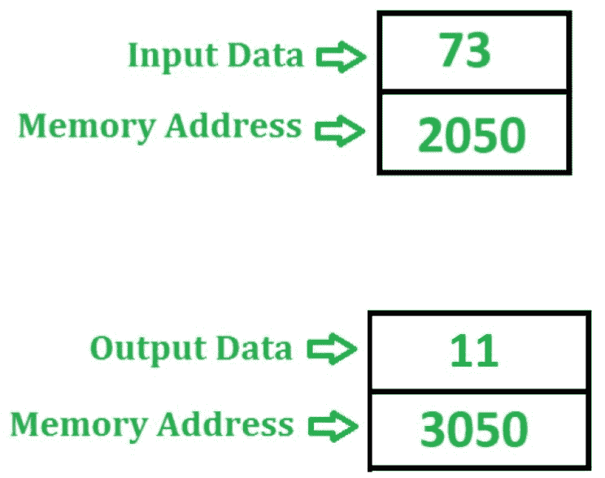
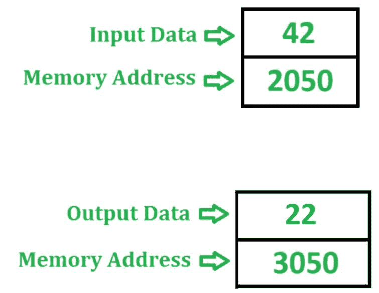

# 8085 程序检查给定数字是偶数还是奇数

> 原文: [https://www.geeksforgeeks.org/8085-program-check-whether-given-number-even-odd/](https://www.geeksforgeeks.org/8085-program-check-whether-given-number-even-odd/)

## 问题
在 8085 微处理器中编写汇编语言程序，检查存储在存储单元 `2050` 中的 8 位数字是偶数还是奇数。如果是偶数，则在存储器位置 `3050` 存储 `22`，否则在存储器位置 `3050` 存储 `11`。

## 示例



如果一个数字的低位是 `1`，则称其为奇数，否则称其为偶数。因此为了识别数字是偶数还是奇数，我们借助 `ANI` 指令用 `01` 进行 AND 运算。如果数字是奇数，那么我们将得到 `01`，否则累加器中为 `00`。`ANI` 指令也影响 8085 的标志位。因此，如果累加器包含 `00`，则置零标志，否则复位。

## 算法
1.  将内存位置 `2050` 的内容加载到累加器 `A` 中。
2.  在 `ANI` 指令的帮助下，用累加器 `A` 的值与 `01` 执行“与”运算。
3.  检查是否设置了零标志，即如果 `ZF = 1`，则将 `22` 存储在累加器 `A` 中，否则将 `11` 存储在 `A` 中。
4.  将 `A` 的值存储在存储单元 `3050` 中。

## 程序
```
JMP 200F    ; 跳转到记忆位置

; 内存地址   助记符        注释
2000        LDA 2050      ; A <- M[2050]
2003        ANI 01        ; A <- A (与) 01
2005        JZ 200D       ; 如果 ZF = 1 则跳转
2008        MVI A 11      ; A <- 11
200A        JMP 200F      ; 跳转到内存位置 200F
200D        MVI A 22      ; A <- 22
200F        STA 3050      ; 在 3050 中存储 A 的值
2012        HLT           ; 停止执行程序
```

## 解释
使用的寄存器 `A`:
1.  `LDA 2050` – 将内存位置 `2050` 的内容加载到累加器 `A` 中。
2.  `ANI 01` – 在累加器 `A` 和 `01` 之间执行“与”运算，并将结果存储在 `A` 中。
3.  `JZ 200D` – 如果 `ZF = 1`，跳转到存储位置 `200D`。
4.  `MVI A 11` – 将 `11` 分配给累加器。
5.  `JMP 200F` – 跳转到内存位置 `200F`。
6.  `MVI A 22` – 将 `22` 分配给累加器。
7.  `STA 3050` – 在 `3050` 中存储 `A` 的值。
8.  `HLT` – 停止执行程序并停止任何进一步的执行。