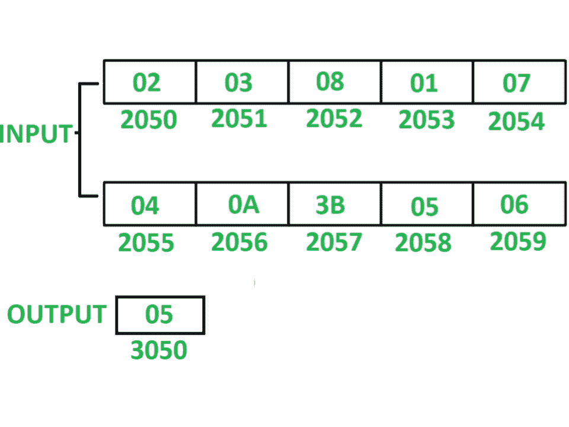

# 8085程序计算10个数系列中的偶数总数

> 原文: [https://www.geeksforgeeks.org/8085-program-count-total-even-numbers-series-10-numbers/](https://www.geeksforgeeks.org/8085-program-count-total-even-numbers-series-10-numbers/)

## 程序–
在8085微处理器中编写汇编语言程序，对10个数串中的偶数进行计数。

## 示例–


## 假设–
从起始存储位置`2050`开始存储10个8位数字。计数值存储在存储器位置`3050`。

## 算法–
1.  用`20`初始化寄存器`H`，用`4F`初始化寄存器`L`，以便间接存储器指向存储单元`204F`。
2.  用`00`初始化寄存器`C`，用`0A`初始化寄存器`D`。
3.  将间接内存增加`1`。
4.  将`M`的值存储在累加器`A`中。
5.  用`01`执行`A`的与运算，检查`A`中的内容是偶数还是奇数。
6.  如果“与”运算后“`A`”的内容为`00`，则扫描的数字为偶数，如果是，则将“`C`”增加`01`；否则，如果“与”运算后“`A`”的内容为`01`，则扫描的数字为奇数，如果是，则将“`D`”减少`01`。
7.  检查是否没有设置零标志，即`ZF = 0`，然后跳转到步骤3，否则在存储器位置`3050`存储`C`的值。

## 程序–
```
【跳跃 if ZF = 0】跳

| 存储地址 | 记忆术 | 评论 |
| --- | --- | --- |
| 2000 | LXI H 204F | H <- 20, L <- 4F |
| 2003 | MVI C, 00 | C <- 00 |
| 2005 | MVI D, 0A | D <- 0A |
| 2007 | INX H | M <- M + 01 |
| 2008 | MOV A, M | A <- M |
| 2009 | ANI 01 | A <- A (与) 01 |
| 200B | JNZ 200F | 如果 ZF = 0 |
| 2013 | MOV A, C | |
```

## 说明–
寄存器`A`、`B`、`C`、`D`、`H`、`L`用于通用。

1.  **`LXI H 204F`**: 给`H`分配`20`，给`L`分配`4F`。
2.  **`MVI C, 00`**: 给`C`分配`00`。
3.  **`MVI D, 0A`**: 分配`0A`给`D`。
4.  **`INX H`**: 将间接内存位置`M`递增`01`。
5.  **`MOV A, M`**: 将`M`的内容移动到`A`。
6.  **`ANI 01`**: 用`01`执行`A`的与运算，并将结果存储在`A`中。
7.  **`JNZ 200F`**: 如果`ZF = 0`，跳转到内存位置`200F`。
8.  **`INR C`**: `C`递增`01`。
9.  **`DCR D`**: `D`递减`01`。
10. **`JNZ 2007`**: 如果`ZF = 0`跳转到内存位置`2007`。
11. **`MOV A, C`**: 将`C`的内容移到`A`。
12. **`STA 3050`**: 将`A`的内容存储到存储器位置`3050`。
13. **`HLT`**: 停止执行程序并停止任何进一步的执行。