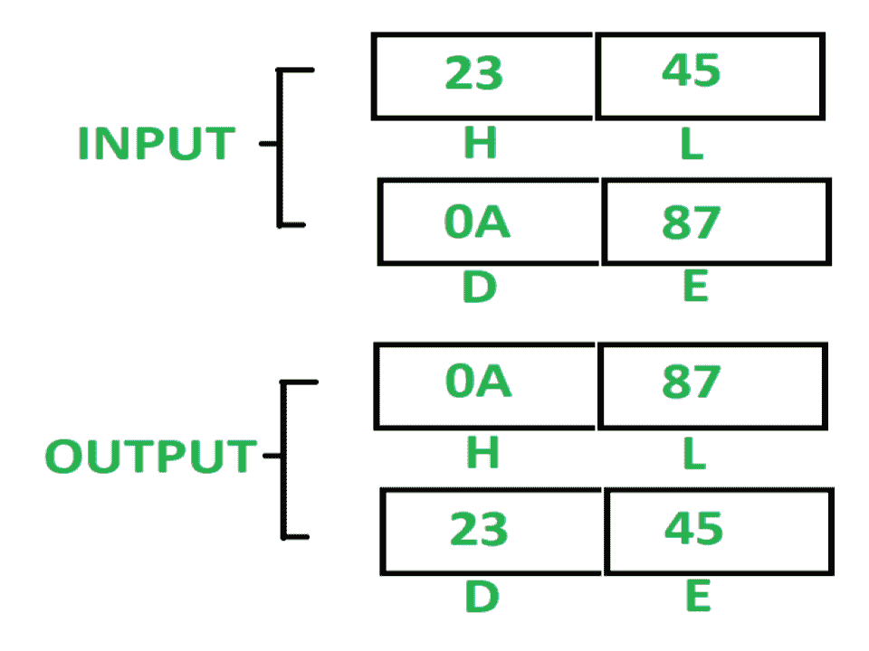

# 8085 程序：交换 HL 与 DE 寄存器对的内容

> 原文：[https://www.geeksforgeeks.org/8085-program-exchange-content-hl-register-pair-de-register-pair/](https://www.geeksforgeeks.org/8085-program-exchange-content-hl-register-pair-de-register-pair/)

## 问题
在 8085 微处理器中编写汇编语言程序，使用 `PUSH` 和 `POP` 指令将 `HL` 寄存器对的内容与 `DE` 寄存器对进行交换。

## 示例


## 假设
内容已经存在于 `HL` 和 `DE` 寄存器中。

## 算法
1.  用 `3FFF` 初始化堆栈指针 `SP`。
2.  将 `H` 和 `L` 寄存器的内容推入堆栈。将 `SP` 减 2。
3.  将 `D` 和 `E` 寄存器的内容推入堆栈。将 `SP` 减 2。
4.  从栈顶取出上面两个字节，放入 `HL` 寄存器。将 `SP` 增加 2。
5.  从栈顶取出剩余的两个字节，放入 `DE` 寄存器。将 `SP` 增加 2。

## 程序
```
| 存储地址 | 记忆术      | 评论                                                                 |
|----------|-------------|----------------------------------------------------------------------|
| 2000     | LXI SP 3FFF | SP <- 3FFF                                                          |
| 2003     | PUSH H      | SP<-SP–1，M[SP]<-H，SP<-SP–1，M[SP]<-L                              |
| 2004     | PUSH D      | SP<-SP–1，M[SP]<-D，SP<-SP–1，M[SP]<-E                              |
| 2005     | POP H       | L <- M[SP]，SP <- SP + 1，H <- M[SP]，SP <- SP + 1                  |
| 2006     | POP D       | E <- M[SP]，SP <- SP + 1，D <- M[SP]，SP <- SP + 1                  |
| 2007     | HLT         | 结束                                                                 |
```

## 解释
使用的寄存器：`H`、`L`、`D`、`E`。

1.  `LXI SP 3FFF`：用 `3FFF` 初始化 `SP`。
2.  `PUSH H`：将 `H` 和 `L` 寄存器的内容推入堆栈，并将堆栈指针减 2。
3.  `PUSH D`：将 `D` 和 `E` 寄存器的内容推入堆栈，并将堆栈指针减 2。
4.  `POP H`：从栈顶弹出上面两个字节，放入 `HL` 寄存器对，`SP` 递增 2。
5.  `POP D`：从栈顶弹出上面两个字节，放入 `DE` 寄存器对，`SP` 递增 2。
6.  `HLT`：停止执行程序并停止任何进一步的执行。