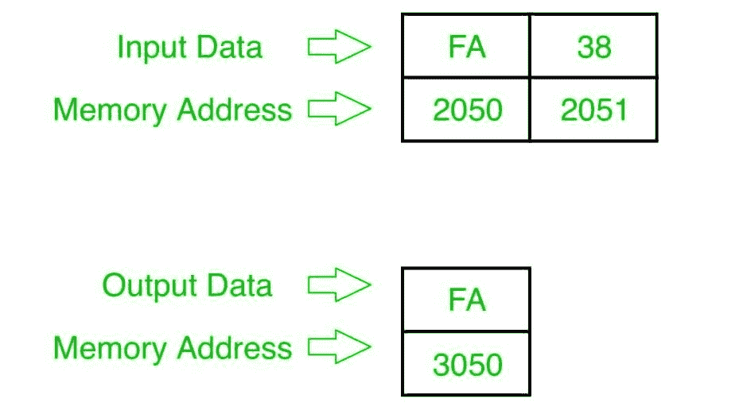

# 8085 程序寻找两个 8 位数字中较大的一个

> 原文:[https://www.geeksforgeeks.org/8085-program-find-larger-two-8-bit-numbers/](https://www.geeksforgeeks.org/8085-program-find-larger-two-8-bit-numbers/)

## 问题
在 8085 微处理器中编写程序，找出两个 8 位数字中较大的一个，其中数字存储在内存地址 `2050` 和 `2051` 中，并将结果存储到内存地址 `3050` 中。

## 示例

## 算法
1.  从内存 `2050` & `2051` 加载两个数字到寄存器 `L` 和 `H`。
2.  将一个数字(`H`)移到累加器 `A`，并从中减去另一个数字(`L`)。
3.  如果结果为正，则将数字(`H`)移动到 `A`，并将 `A` 的值存储在存储器地址 `3050`，然后停止，否则将数字(`L`)移动到 `A`，将 `A` 的值存储在存储器地址 `3050`，然后停止。

## 程序
| 存储地址 | 记忆术 | 评论 |
| --- | --- | --- |
| `2000` | `LHLD 2050` | `H`<-(`2051`)，`L`<-(`2050`) |
| `2003` | `MOV A, H` | `A`<-`H` |
| `2004` | `SUB L` | `A`<-`A`-`L` |
| `2005` | `JP 200D` | 如果否，跳到 `200D` |
| `2008` | `MOV A, L` | `A`<-`L` |
| `2009` | `STA 3050` | `A`->(内存 `3050`) |
| `200C` | `HLT` | 停止 |
| `200D` | `MOV A, H` | `A`<-`H` |
| `200E` | `STA 3050` | `A`->(内存 `3050`) |
| `2011` | `HLT` | 停止 |

## 解释
1.  `LHLD 2050`: 从内存 `2050` & `2051` 加载数据到寄存器 `L` 和 `H`。
2.  `MOV A, H`: 将寄存器 `H` 的内容传送给 `A`。
3.  `SUB L`: 从 `A` 中减去寄存器 `L` 的内容，存储到 `A` 中。
4.  `JP 200D`: 如果结果为正，跳转到地址 `200D`。
5.  `MOV A, L`: 将寄存器 `L` 的内容传送给 `A`。
6.  `STA 3050`: 将 `A` 的数据存储到存储器地址 `3050`。
7.  `HLT`: 结束。
8.  `MOV A, H`: 将寄存器 `H` 的内容传送给 `A`。
9.  `STA 3050`: 将 `A` 的数据存储到存储器地址 `3050`。
10. `HLT`: 结束。