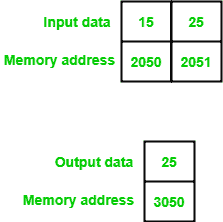

# 8085 程序寻找两个 8 位数字的最大值

> 原文: [https://www.geeksforgeeks.org/8085-program-find-maximum-two-8-bit-numbers/](https://www.geeksforgeeks.org/8085-program-find-maximum-two-8-bit-numbers/)

## 问题
编写汇编语言程序，在 8085 微处理器中找到最多两个 8 位数字。

## 假设
起始内存位置和输出内存位置分别为 `2050`、`2051` 和 `3050`。

## 示例


## 算法
1.  累加器中的负载值
2.  然后，将该值复制到任何寄存器中
3.  将下一个值载入累加器
4.  比较两个值
5.  检查进位标志，如果复位，则跳到所需的地址来存储该值
6.  将结果复制到累加器中
7.  将结果存储在所需的地址

## 程序
```
2000: LDA 2050    ; A <- M[2050]
2003: MOV B, A    ; B <- A
2004: LDA 2051    ; A <- M[2051]
2007: CMP B       ; A - B
2008: JNC 200C    ; Jump if Carry Flag is reset (CY=0)
200B: MOV A, B    ; A <- B
200C: STA 3050    ; M[3050] <- A
200F: HLT         ; Terminate program
```

## 解释
1.  `LDA 2050`: 在内存位置 `2050` 加载值
2.  `MOV B, A`: 给 `B` 赋值 `A`
3.  `LDA 2051`: 在内存位置 `2051` 加载值
4.  `CMP B`: 通过从 `A` 中减去 `B` 来比较值
5.  `JNC 200C`: 如果进位标志被重置（进位标志= `0`），则在存储器位置 `200C` 跳转
6.  `STA 3050`: 将结果存储在存储器位置 `3050`
7.  `HLT`: 终止程序