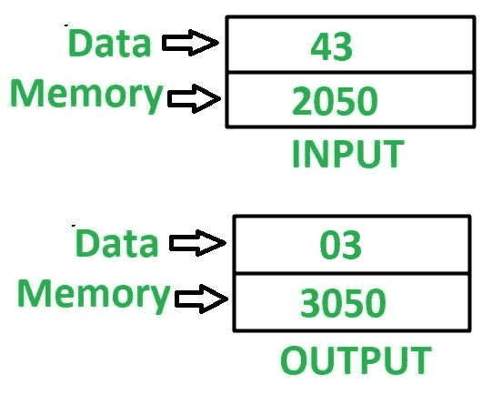

# 8085 程序寻找 8 位数字中数字的最小值

> 原文: [https://www.geeksforgeeks.org/8085-program-find-minimum-value-digit-8-bit-number/](https://www.geeksforgeeks.org/8085-program-find-minimum-value-digit-8-bit-number/)

## 问题
在 8085 微处理器中编写汇编语言程序，求 8 位数字中数字的最小值。

## 示例
假设 8 位数字存储在存储位置 `2050`，最小值数字存储在存储位置 `3050`。

## 算法
1.  将内存位置 `2050` 的内容加载到累加器 `A` 中。
2.  在寄存器 `B` 中移动 `A` 的内容。
3.  用 `0F` 对 `A` 的内容进行与运算，并将结果存储在 `A` 中。
4.  在寄存器 `C` 中移动 `A` 的内容。
5.  在 `A` 中移动 `B` 的内容。
6.  使用 `RLC` 指令反转 `A` 的内容 4 次。
7.  用 `0F` 对 `A` 的内容进行与运算，并将结果存储在 `A` 中。
8.  借助 `CMP C` 指令比较 `A` 和 `C` 的内容。
9.  检查是否设置了进位标志，然后跳转到存储位置 `2013`，否则将 `C` 的内容移到 `A`。转到存储位置 `2013`。
10. 将 `A` 的值存储在存储单元 `3050` 中。

注意：`CMP` 指令比较 `A` 和 `C` 的值。如果 `A > C`，则进位标志复位，否则设置。

## 程序

| 存储地址 | 记忆术 | 评论 |
| :--- | :--- | :--- |
| `2000` | `LDA 2050` | `A <- M[2050]` |
| `2003` | `MOV B, A` | `B <- A` |
| `2004` | `ANI 0F` | `A <- A (与) 0F` |
| `2006` | `MOV C, A` | `C <- A` |
| `2007` | `MOV A, B` | `A <- B` |
| `2008` | `RLC` | 将累加器的内容向左旋转 1 位，无需进位 |
| `2009` | `RLC` | 将累加器的内容向左旋转 1 位，无需进位 |
| `200A` | `RLC` | 将累加器的内容向左旋转 1 位，无需进位 |
| `200B` | `RLC` | 将累加器的内容向左旋转 1 位，无需进位 |
| `200C` | `ANI 0F` | `A <- A (与) 0F` |
| `200E` | `CMP C` | `A - C` |
| `200F` | `JC 2013` | 如果 `CY = 1` 则跳转 |
| `2012` | `MOV A, C` | `A <- C` |
| `2013` | `STA 3050` | `M[3050] <- A` |
| `2016` | `HLT` | 结束 |

## 说明
寄存器 `A`、`B`、`C` 用于通用。

1.  **`LDA 2050`**: 加载 `A` 中内存位置 `2050` 的内容。
2.  **`MOV B, A`**: 移动 `B` 中 `A` 的内容。
3.  **`ANI 0F`**: 在 `A` 的内容和 `0F` 的值之间执行“与”运算。
4.  **`MOV C, A`**: 移动 `C` 中 `A` 的内容。
5.  **`MOV A, B`**: 移动 `A` 中 `B` 的内容。
6.  **`RLC`**: 将 `A` 的内容左移 1 位，不进位。使用此指令 4 次，反转 `A` 的内容。
7.  **`ANI 0F`**: 在 `A` 的内容和 `0F` 的值之间执行“与”运算。
8.  **`CMP C`**: 比较 `A`、`C` 的内容，并相应更新进位标志的值。
9.  **`JC 2013`**: 如果 `CY = 1`，跳转到内存位置 `2013`。
10. **`MOV A, C`**: 移动 `A` 中 `C` 的内容。
11. **`STA 3050`**: 将 `A` 的内容存储在存储单元 `3050` 中。
12. **`HLT`**: 停止执行程序并停止任何进一步的执行。