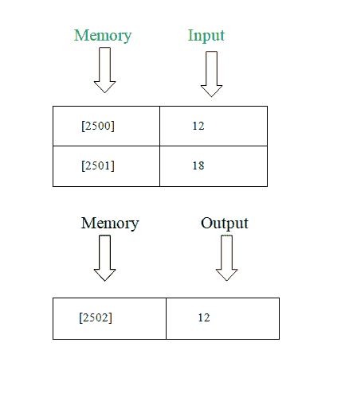

# 8085 程序寻找两个数之间的最小数

> 原文：[https://www.geeksforgeeks.org/8085-program-find-smallest-number-two-numbers/](https://www.geeksforgeeks.org/8085-program-find-smallest-number-two-numbers/)

## 问题
写一个汇编语言程序，在两个数之间找到**最小的数**。

## 示例

## 算法
1.  从内存位置加载内容。
2.  将`累加器`的内容移入`寄存器` B。
3.  从`内存位置`加载内容。
4.  对比`寄存器` B的内容。
5.  如果进位标志等于 1，转到步骤 7。
6.  将`寄存器` B的内容移入`累加器`。
7.  将内容存储到`内存`。
8.  程序结束。

## 程序

| 记忆 | 记忆术 | 使用操作数 | 评论 |
| --- | --- | --- | --- |
| `2000` | `LDA` | `[2500]` | `[A]` |
| `2003` | `MOV B, A` | | `[B]` |
| `2004` | `LDA` | `2501` | `[A]` |
| `2007` | `CMP` | | `[A]` |
| `2008` | `JC` | `200C` | 跳跃进位 |
| `200B` | `MOV A, B` | | `[A]` |
| `200C` | `STA` | `2502` | `[A]->[2502]` |
| `200F` | `HLT` | | 停止 |

## 解释
1.  `LDA` 用于加载累加器(3 字节指令)。
2.  `CMP` 用于比较累加器(1 字节指令)的内容。
3.  `STA` 用于使用 16 位地址(3 字节指令)直接存储累加器。
4.  如果进位，则 `JC` 跳转(3 字节指令)。