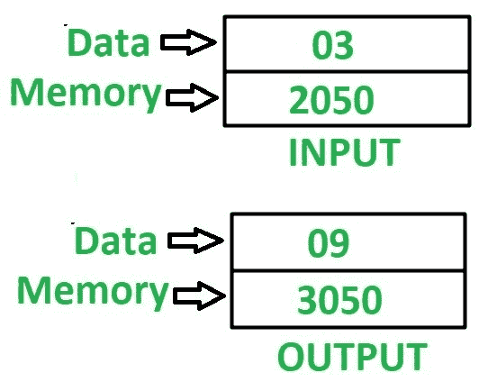

# 8085 程序求一个 8 位数的平方

> 原文：[https://www.geeksforgeeks.org/8085-program-find-square-8-bit-number/](https://www.geeksforgeeks.org/8085-program-find-square-8-bit-number/)

## 问题
在 8085 微处理器中编写汇编语言程序，求 8 位数的平方。

## 示例


## 假设
输入数据和输出数据的地址分别为 `2050` 和 `3050`。

## 方法
结合寄存器 `H` 和 `L` 的内容，得到的内容可以用来间接指向内存位置，该内存位置由 `m` 指定。要找到任何数字的平方，继续将累加器 `A` 中最初包含 `0` 的那个数字加上我们需要找到其平方的次数。

## 算法
1.  将 `20` 分配给寄存器 `H`，`50` 分配给寄存器 `L`，`00` 分配给累加器 `A`
2.  加载寄存器 `B` 中由 `M` 指定的存储单元的内容
3.  将累加器 `A` 中 `M` 的含量和 `B` 的减量值加 `01`
4.  检查 `B` 是否为 `00`，如果为真，则将 `A` 的值存储在存储器位置 `3050`，否则转到步骤 3

## 程序
```
内存地址    助记符        comment
2000        MVI H 20     H <- 20
2002        MVI L 50     L <- 50
2004        MVI A 00     A <- 00
2006        MOV B, M     B <- M
2007        ADD M        A <- A + M
2008        DCR B        B <- B - 01
2009        JNZ 2007     如果 ZF = 0 则跳转
200C        STA 3050     M[3050] <- A
200F        HLT          结束
```

## 解释
寄存器使用了 `A`、`H`、`L`、`B` 和间接存储器 `M`：
1.  `MVI H 20` – 用 `20` 初始化寄存器 `H`
2.  `MVI L 50` – 用 `50` 初始化寄存器 `L`
3.  `MVI A 00` – 用 `00` 初始化累加器 `A`
4.  `MOV B, M` – 移动寄存器 `B` 中由 `M` 间接指定的存储单元的内容
5.  `ADD M` – 在累加器 `A` 中添加 `M` 间接指定的内存位置内容
6.  `DCR B` – 寄存器 `B` 的值递减 `1`
7.  `JNZ 2007` – 如果 `ZF = 0`，即寄存器 `B` 不包含 `0`，则跳转到存储单元 `2007`
8.  `STA 3050` – 在 `3050` 中存储 `A` 的值
9.  `HLT` – 停止执行程序并停止任何进一步的执行