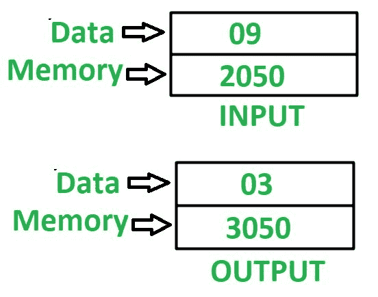

# 8085 程序求一个数的平方根

> 原文: [https://www.geeksforgeeks.org/8085-program-find-square-root-number/](https://www.geeksforgeeks.org/8085-program-find-square-root-number/)

**问题–** 在 8085 微处理器中编写汇编语言程序，求一个数的平方根。

**示例–**


**假设–**
我们需要找到其平方根的数存储在内存位置 `2050`，最终结果将存储在内存位置 `3050`。

**算法–**
1.  将 `01` 分配给寄存器 `D` 和 `E`。
2.  加载存储在累加器 `A` 的存储单元 `2050` 中的值。
3.  从寄存器 `D` 中减去累加器 `A` 中存储的值。
4.  检查累加器是否保持 `0`，如果为真，则跳至步骤 8。
5.  寄存器 `D` 的值增加 `2`。
6.  寄存器 `E` 的值增加 `1`。
7.  跳到第三步。
8.  将存储在寄存器 `E` 中的值移入寄存器 `A`。
9.  将 `A` 的值存储在存储单元 `3050` 中。

**程序–**
```
2000: MVI D, 01    ; D <- 01
2002: MVI E, 01    ; E <- 01
2004: LDA 2050     ; A <- M[2050]
2007: SUB D        ; A <- A - D
2008: JZ 2011      ; 如果 ZF = 1，跳转到内存位置 2011
200B: INR D        ; D <- D + 1
200C: INR D        ; D <- D + 1
200D: INR E        ; E <- E + 1
200E: JMP 2007     ; 跳转到内存位置 2007
2011: MOV A, E     ; A <- E
2012: STA 3050     ; A -> M[3050]
2015: HLT          ; 结束
```

**解释–** 使用的寄存器 `A`、`D`、`E`:
1.  `MVI D, 01` – 用 `01` 初始化寄存器 `D`。
2.  `MVI E, 01` – 用 `01` 初始化寄存器 `E`。
3.  `LDA 2050` – 将内存位置 `2050` 的内容加载到累加器 `A` 中。
4.  `SUB D` – 从 `A` 中减去 `D` 的值。
5.  `JZ 2011` – 如果设置了零标志，则跳转到存储器位置 `2011`。
6.  `INR D` – 将寄存器 `D` 的值增加 `1`。因为它被使用了两次，所以 `D` 的值增加了 `2`。
7.  `INR E` – 将寄存器 `E` 的值增加 `1`。
8.  `JMP 2007` – 跳转到内存位置 `2007`。
9.  `MOV A, E` – 将寄存器 `E` 的值移动到累加器 `A` 中。
10. `STA 3050` – 在 `3050` 中存储 `A` 的值。
11. `HLT` – 停止执行程序并停止任何进一步的执行。