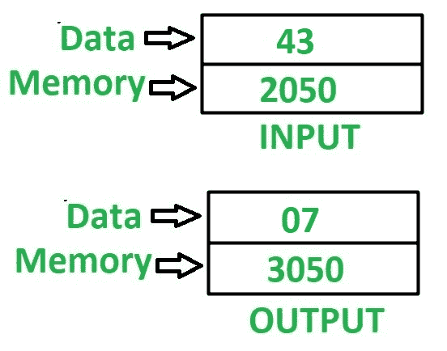

# 8085 程序求 8 位数字的和

> 原文:[https://www.geeksforgeeks.org/8085-program-find-sum-digits-8-bit-number/](https://www.geeksforgeeks.org/8085-program-find-sum-digits-8-bit-number/)

## 问题
在 8085 微处理器中编写汇编语言程序，求一个 8 位数字的位数之和。

## 示例


## 假设
输入数据和输出数据的地址分别为 `2050` 和 `3050`。

## 算法
1.  加载存储在累加器 `A` 的存储单元 `2050` 中的值。
2.  移动寄存器 `B` 中累加器 `A` 的值。
3.  在 `ANI` 指令的帮助下，执行半字节的屏蔽，即执行累加器 `A` 的与操作。我们将在累加器 `A` 中得到较低的半字节值。
4.  移动寄存器 `C` 中累加器 `A` 的值。
5.  移动累加器 `A` 中寄存器 `B` 的值。
6.  通过使用 `RLC` 指令 4 次反转存储在累加器 `A` 中的数字，并按照步骤 3 中的操作再次屏蔽半字节。
7.  将累加器 `A` 中寄存器 `C` 的值相加。
8.  将 `A` 的值存储在存储单元 `3050` 中。

## 程序
```
| 内存地址 | 助记符      | comment          |
|----------|-------------|------------------|
| 2000     | LDA 2050    | A<-M[2050]       |
| 2003     | MOV B, A    | B <- A           |
| 2004     | ANI 0F      | A <- A(与)0F     |
| 2006     | MOV C, A    | C <- A           |
| 2007     | MOV A, B    | A <- B           |
| 2008     | RLC         | 不进位向左旋转   |
| 2009     | RLC         | 不进位向左旋转   |
| 200A     | RLC         | 不进位向左旋转   |
| 200B     | RLC         | 不进位向左旋转   |
| 200C     | ANI 0F      | A <- A(与)0F     |
| 200E     | ADD C       | A <- A + C       |
| 200F     | STA 3050    | M[3050]<-A       |
| 2012     | HLT         | 结束             |
```

## 解释
使用的寄存器 `A`、`B`、`C`。

1.  `LDA 2050` – 将内存位置 `2050` 的内容加载到累加器 `A` 中。
2.  `MOV B, A` – 移动寄存器 `B` 中累加器 `A` 的值。
3.  `ANI 0F` – 在累加器 `A` 和 `0F` 的值中执行“与”运算。
4.  `MOV C, A` – 移动寄存器 `C` 中累加器 `A` 的值。
5.  `MOV A, B` – 移动累加器 `A` 中寄存器 `B` 的值。
6.  `RLC` – 指令将累加器 `A` 的值旋转 1 位。由于它被执行 4 次，因此这将反转数字，即，用更高阶的半字节交换更低阶的半字节。
7.  重复步骤 3。
8.  `ADD C` – 添加累加器 `A` 中 `C` 的寄存器内容。
9.  `STA 3050` – 在 `3050` 中存储 `A` 的值。
10. `HLT` – 停止执行程序并停止任何进一步的执行。