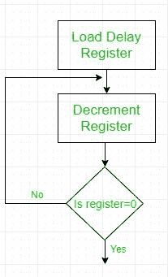

# 8085 程序为十六进制计数器

> 原文: [https://www.geeksforgeeks.org/8085-program-for-hexadecimal-counter/](https://www.geeksforgeeks.org/8085-program-for-hexadecimal-counter/)

编写一个程序，在时钟频率为 0.5 微秒的系统中，从 `FFH` 到 `00H` 以十六进制连续计数。使用寄存器 `C` 在每个输出端口的计数和显示输出之间设置 1 毫秒的延迟。

## 问题分析

1.  十六进制计数器的设置是通过加载一个带有起始数的寄存器，并递减它直到达到零，然后再递减它到将产生-1，这是 `FFH` 的二进制补码。因此，登记册再次到达 `FFH`。
2.  1 毫秒的时间延迟由流程图所示的程序设置-
    
    寄存器加载适当的数字，使得上述循环的执行产生 1 毫秒的时间延迟。

## 程序

```
| 地址 | 标签 | 记忆术 |
| --- | --- | --- |
| 2000H |  | MVI B, FFH |
| 2002H | NEXT | DCR B |
| 2003H |  | MVI C, COUNT |
| 2005H | DELAY | DCR C |
| 2006H |  | JNZ DELAY |
| 2009H |  | MOV A, B |
| 200AH |  | OUT 01H |
| 200CH |  | JMP NEXT |
```

`C` 寄存器是时间延迟寄存器，由一个值 `COUNT` 加载，产生 1 毫秒的时间延迟。
要找到 `COUNT` 的值，我们需要-

```
TD = TL + TO
where- TD = Time Delay
TL = Time delay inside loop
TO = Time delay outside loop
```

**延迟循环**包括两个指令- `DCR C` (4 个 `T` 状态)和 `JNZ` (10 个 `T` 状态)
所以 `T_L = 14 * 时钟周期 * COUNT`
=> `14 * (0.5 * 10^-6) * COUNT`
=> `(7 * 10^-6) * COUNT`

**在循环外的延迟**该循环包括-
`DCR B` : 4T
`MVI C, COUNT` : 7T
`MOV A, B` : 4T
`OUT 01H` : 10T
`JMP` : 10T
总计: 35T

`T_O = 35 * 时钟周期` => 17.5 微秒

所以，1 毫秒 = (17.5 + 7 * COUNT) 微秒

**因此，`COUNT = (140)_10`**