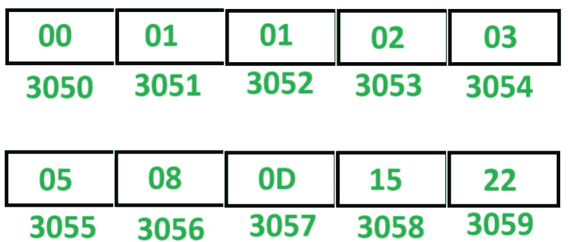

# 8085 程序生成斐波那契数列

> 原文:[https://www . geesforgeks . org/8085-program-generate-Fibonacci-series/](https://www.geeksforgeeks.org/8085-program-generate-fibonacci-series/)

## 问题
在 8085 微处理器中编写汇编语言程序，生成斐波那契数列。

## 示例
假设斐波那契数列存储在起始存储位置 `3050`。

## 注意
这个程序生成十六进制数的斐波那契数列。

## 算法
1.  用 `30` 初始化寄存器 `H`，用 `50` 初始化寄存器 `L`，这样间接存储器 `M` 指向存储单元 `3050`。
2.  用 `00` 初始化寄存器 `B`，用 `08` 初始化寄存器 `C`，用 `01` 初始化寄存器 `D`。
3.  在 `M` 中移动 `B` 的内容。
4.  将 `M` 增加 `1`，使 `M` 指向下一个存储位置。
5.  在 `M` 中移动 `D` 的内容。
6.  移动累加器 `A` 中的 `B` 的内容。
7.  在 `A` 中加入 `D` 的内容。
8.  移动 `B` 中 `D` 的内容。
9.  在 `D` 中移动 `A` 的内容。
10. 将 `M` 增加 `1`，使 `M` 指向下一个存储位置。
11. 在 `M` 中移动 `A` 的内容。
12. `C` 减 `1`。
13. 如果 `ZF = 0`，跳到存储单元 `200C`，否则暂停程序。

## 程序

| 存储地址 | 记忆术 | 评论 |
| :--- | :--- | :--- |
| `2000` | `LXI H，3050` | `H <- 30，L <- 50` |
| `2003` | `MVI C，08` | `C <- 08` |
| `2005` | `MVI B， 00` | `B <- 00` |
| `2007` | `MVI D，01` | `D <- 01` |
| `2009` | `MOV M，B` | `M <- B` |
| `200A` | `INX H` | `M <- M + 01` |
| `200B` | `MOV M，D` | `M <- D` |
| `200C` | `MOV A，B` | `A <- B` |
| `200D` | `ADD D` | `A <- A + D` |
| `200E` | `MOV B，D` | `B <- D` |
| `200F` | `MOV D，A` | `D <- A` |
| `2010` | `INX H` | `M <- M + 01` |
| `2011` | `MOV M，A` | `M <- A` |
| `2012` | `DCR C` | `C <- C–01` |
| `2013` | `JNZ 200C` | 如果 `ZF = 0` 则跳转 |
| `2016` | `HLT` | 结束 |

## 说明
寄存器 `A`、`B`、`C`、`D`、`H`、`L` 用于通用。

1.  `LXI H 3050`: 给 `H` 分配 `30`，给 `L` 分配 `50`。
2.  `MVI B，00`: 给 `B` 分配 `00`。
3.  `MVI C，08`: 给 `C` 分配 `08`。
4.  `MVI D，01`: 给 `D` 分配 `01`。
5.  `MOV M，B`: 移动 `M` 中 `B` 的内容。
6.  `INX H`: 将 `M` 增加 `1`。
7.  `MOV M，D`: 移动 `M` 中 `D` 的内容。
8.  `MOV A，B`: 移动 `A` 中 `B` 的内容。
9.  `ADD D`: 添加 `D` 和 `A` 的内容，将结果存入 `A`。
10. `MOV B，D`: 移动 `B` 中 `D` 的内容。
11. `MOV D，A`: 移动 `D` 中 `A` 的内容。
12. `INX H`: 将 `M` 增加 `1`。
13. `MOV M，A`: 移动 `M` 中 `A` 的内容。
14. `DCR C`: `C` 减 `1`。
15. `JNZ 200C`: 如果 `ZF = 0`，跳转到内存位置 `200C`。
16. `HLT`: 停止执行程序并停止任何进一步的执行。