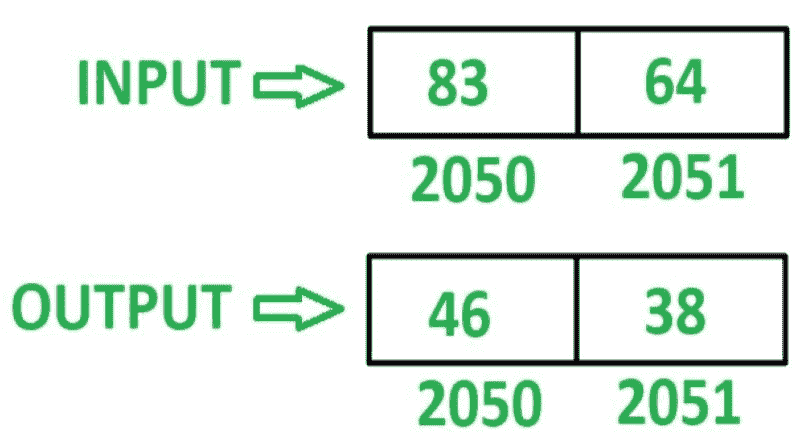

# 8085 程序反转 16 位数字

> 原文: [https://www.geeksforgeeks.org/8085-program-reverse-16-bit-number/](https://www.geeksforgeeks.org/8085-program-reverse-16-bit-number/)

## 问题
在 8085 微处理器中编写汇编语言程序，倒 16 位数字。

## 示例
假设 16 位数字存储在存储器位置 `2050` 和 `2051`。

## 算法
1.  加载寄存器 `L` 中存储单元 `2050` 的内容和寄存器 `H` 中存储单元 `2051` 的内容。
2.  移动累加器 `A` 中 `L` 的内容。
3.  通过执行 `RLC` 指令 4 次来反转 `A` 的内容。
4.  将 `A` 的内容移入 `L`。
5.  在 `A` 中移动 `H` 的内容。
6.  通过执行 `RLC` 指令 4 次来反转 `A` 的内容。
7.  在 `H` 中移动 `L` 的内容。
8.  将 `A` 的内容移入 `L`。
9.  在存储单元 `2050` 中存储 `L` 的内容，在存储单元 `2051` 中存储 `H` 的内容。

## 程序

| 存储地址 | 记忆术 | 评论 |
| :--- | :--- | :--- |
| `2000` | `LHLD 2050` | `L<-M[2050]，H<-M[2051]` |
| `2003` | `MOV A，L` | `A <- L` |
| `2004` | `RLC` | 将累加器内容旋转 1 位，不进位 |
| `2005` | `RLC` | 将累加器内容旋转 1 位，不进位 |
| `2006` | `RLC` | 将累加器内容旋转 1 位，不进位 |
| `2007` | `RLC` | 将累加器内容旋转 1 位，不进位 |
| `2008` | `MOV L，A` | `L <- A` |
| `2009` | `MOV A，H` | `A <- H` |
| `200A` | `RLC` | 将累加器内容旋转 1 位，不进位 |
| `200B` | `RLC` | 将累加器内容旋转 1 位，不进位 |
| `200C` | `RLC` | 将累加器内容旋转 1 位，不进位 |
| `200D` | `RLC` | 将累加器内容旋转 1 位，不进位 |
| `200E` | `MOV H，L` | `H <- L` |
| `200F` | `MOV L，A` | `L <- A` |
| `2010` | `SHLD 2050` | `M[2050]<-L，M[2051]<-H` |
| `2013` | `HLT` | 结束 |

## 说明
寄存器 `A`、`H`、`L` 用于通用。

1.  `LHLD 2050`: 加载内存位置 `2050` 在 `L`，`2051` 在 `H` 的内容。
2.  `MOV A，L`: 移动 `A` 中 `L` 的含量。
3.  `RLC`: 将 `A` 的内容左移一位，不进位。重复当前指令 4 次，使 `A` 的内容反转。
4.  `MOV L，A`: 移动 `L` 中 `A` 的含量。
5.  `MOV A，H`: 移动 `A` 中 `H` 的含量。
6.  `RLC`: 将 `A` 的内容左移一位，不进位。重复当前指令 4 次，使 `A` 的内容反转。
7.  `MOV H，L`: 移动 `H` 中 `L` 的含量。
8.  `MOV L，A`: 移动 `L` 中 `A` 的含量。
9.  `SHLD 2050`: 存储 `2050` 年 `L` 和 `2051` 年 `H` 的含量。
10. `HLT`: 停止执行程序并停止任何进一步的执行。