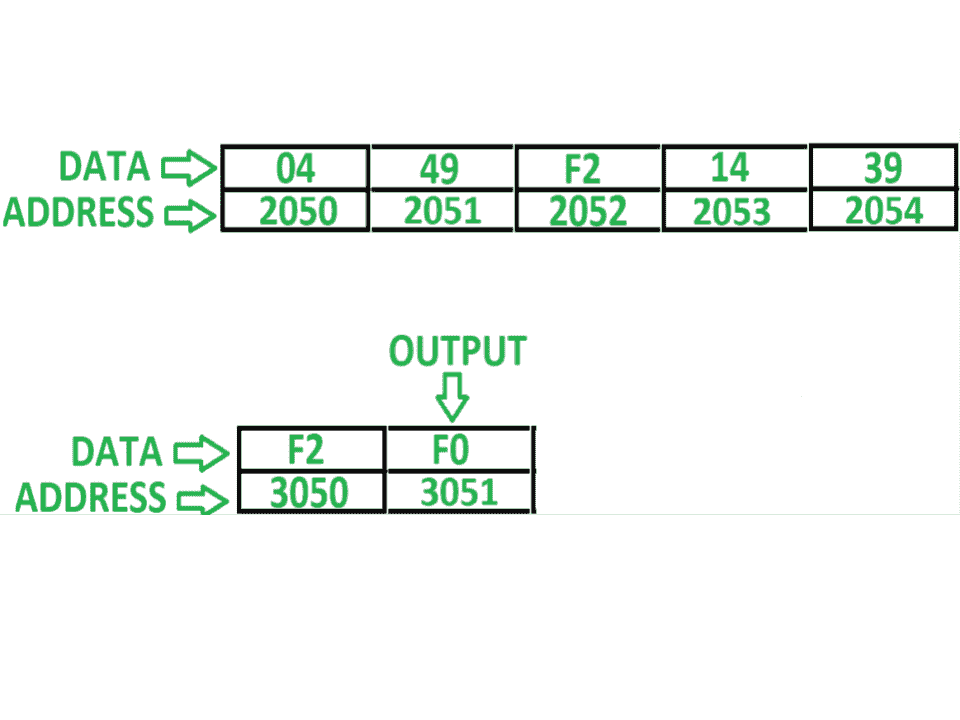
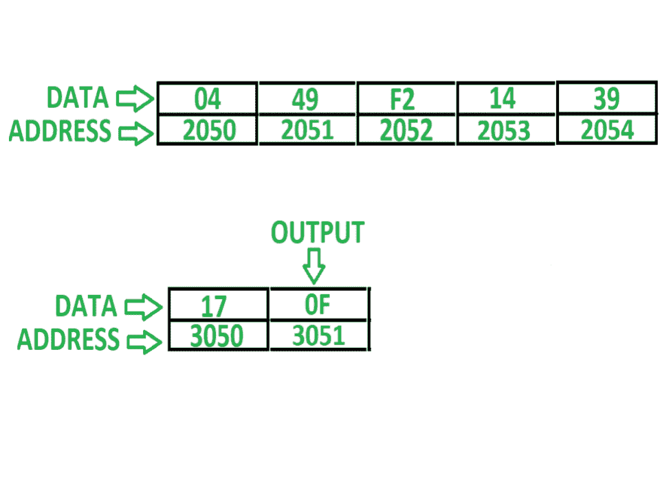

# 8085 程序在 n 个数字的数组中搜索一个数字

> 原文: [https://www.geeksforgeeks.org/8085-program-search-number-array-n-numbers/](https://www.geeksforgeeks.org/8085-program-search-number-array-n-numbers/)

## 问题
用 8085 编写汇编语言程序，在 n 个数字的数组中搜索给定的数字。如果找到号码，则将 `F0` 存储在存储器位置 `3051`，否则将 `0F` 存储在 `3051`。

## 假设
阵列中的元素计数存储在存储器位置 `2050`。数组从起始存储器地址 `2051` 开始存储，用户想要搜索的号码存储在存储器位置 `3050`。

## 示例

## 算法
1.  借助 `LXI H 2050` 指令，使内存指针指向内存位置 `2050`
2.  将数组大小的值存储在寄存器 `C` 中
3.  将待搜索号码存储在寄存器 `B` 中
4.  将内存指针增加 1，使其指向下一个数组索引
5.  将数组元素存储在累加器 `A` 中，并与 `B` 的值进行比较
6.  如果两者相同，即如果 `ZF = 1`，则将 `F0` 存储在 `A` 中，并将结果存储在存储单元 `3051` 中，并转到步骤 9
7.  否则，将 `0F` 存储在 `A` 中，并将其存储在存储器位置 `3051` 中
8.  将 `C` 递减 `01`，并检查 `C` 是否不等于零，即 `ZF = 0`，如果为真，转到步骤 3，否则转到步骤 9
9.  程序结束

## 程序
| 内存地址 | 助记符 | 注释 |
| :--- | :--- | :--- |
| `2000` | `LXI H 2050` | `H <- 20, L <- 50` |
| `2003` | `MOV C, M` | `C <- M` |
| `2004` | `LDA 3050` | `A <- M[3050]` |
| `2007` | `MOV B, A` | `B <- A` |
| `2008` | `INX H` | `HL <- HL + 0001` |
| `2009` | `MOV A, M` | `A <- M` |
| `200A` | `CMP B` | `A - B` |
| `200B` | `JNZ 2014` | 如果 `ZF = 0` 则跳转 |
| `200E` | `MVI A F0` | `A <- F0` |
| `2010` | `STA 3051` | `M[3051] <- A` |
| `2013` | `HLT` | 结束 |
| `2014` | `MVI A 0F` | `A <- 0F` |
| `2016` | `STA 3051` | `M[3051] <- A` |
| `2019` | `DCR C` | `C <- C - 01` |
| `201A` | `JNZ 2008` | 如果 `ZF = 0` 则跳转 |
| `201D` | `HLT` | 结束 |

## 解释
寄存器使用了 `A`、`B`、`C`、`H`、`L` 和间接存储器 `M`:

1.  `LXI H 2050` – 用 `20` 初始化寄存器 `H`，用 `50` 初始化寄存器 `L`
2.  `MOV C, M` – 将由寄存器 `H` 和 `L` 表示的间接存储单元 `M` 的内容分配给寄存器 `C`
3.  `LDA 3050` – 将内存位置 `3050` 的内容加载到累加器 `A` 中
4.  `MOV B, A` – 移动寄存器 `B` 中 `A` 的内容
5.  `INX H` – 将 `HL` 增加 1，即 `M` 增加 1，现在 `M` 将指向下一个内存位置
6.  `MOV A, M` – 移动累加器 `A` 中内存位置 `M` 的内容
7.  `CMP B` – 从 `A` 中减去 `B`，更新标志 8085
8.  `JNZ 2014` – 如果重置零标志，即 `ZF = 0`，则跳转到存储单元 `2014`
9.  `MVI A F0` – 将 `F0` 分配给 `A`
10. `STA 3051` – 在 `3051` 中存储 `A` 的值
11. `HLT` – 停止执行程序并停止任何进一步的执行
12. `MVI A 0F` – 将 `0F` 分配给 `A`
13. `STA 3051` – 在 `3051` 中存储 `A` 的值
14. `DCR C` – `C` 递减 `01`
15. `JNZ 2008` – 如果重置零标志，跳转到存储单元 `2008`
16. `HLT` – 停止执行程序并停止任何进一步的执行