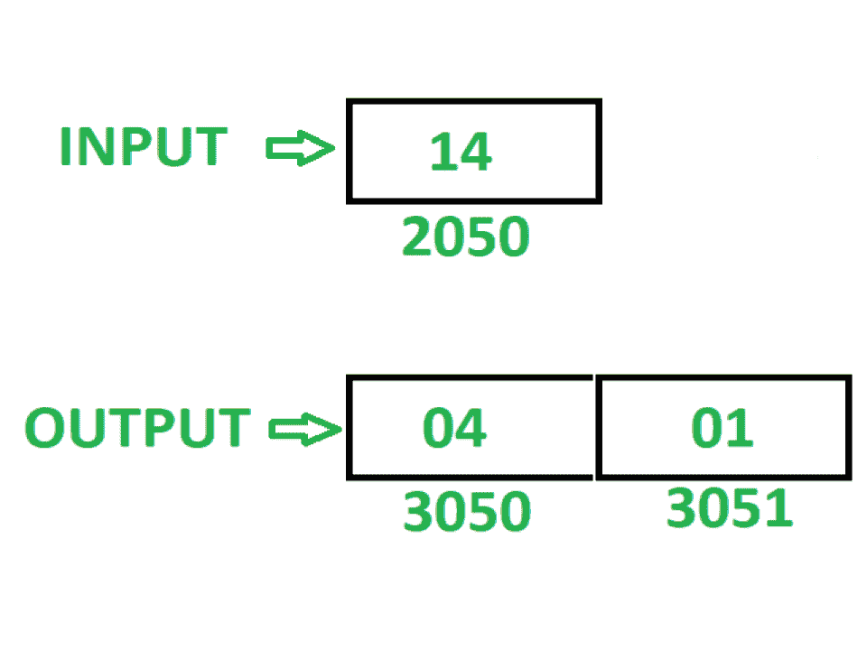

# 8085 程序，显示 8 位数字的较低和较高半字节的屏蔽

> 原文: [https://www.geeksforgeeks.org/8085-program-show-masking-lower-higher-nibbles-8-bit-number/](https://www.geeksforgeeks.org/8085-program-show-masking-lower-higher-nibbles-8-bit-number/)

## 问题
在 8085 微处理器中编写汇编语言程序，显示 8 位数字的低半字节和高半字节的屏蔽。

## 示例

## 假设
8 位数字存储在存储器位置 `2050`。在屏蔽半字节后，低位半字节存储在存储单元 `3050`，高位半字节存储在存储单元 `3051`。

## 算法
1.  将内存位置 `2050` 的内容加载到累加器 `A` 中。
2.  在寄存器 `B` 中移动 `A` 的内容。
3.  用 `0F` 执行“与”运算，并将结果存储在存储单元 `3050` 中。
4.  在 `A` 中移动 `B` 的内容。
5.  用 `0F` 执行“与”运算，并使用 `RLC` 指令反转结果 4 次。
6.  将结果存储在内存位置 `3051`。

## 程序

| 存储地址 | 记忆术 | 评论 |
| :--- | :--- | :--- |
| `2000` | `LDA 2050` | `A<-M[2050]` |
| `2003` | `MOV B, A` | `B <- A` |
| `2004` | `ANI 0F` | `A <- A(与)0F` |
| `2006` | `STA 3050` | `M[3050]<-A` |
| `2009` | `MOV A, B` | `A <- B` |
| `200A` | `ANI 0F` | `A <- A(与)0F` |
| `200C` | `RLC` | 将 `A` 的内容向左旋转 1 位不进位 |
| `200D` | `RLC` | 将 `A` 的内容向左旋转 1 位不进位 |
| `200E` | `RLC` | 将 `A` 的内容向左旋转 1 位不进位 |
| `200F` | `RLC` | 将 `A` 的内容向左旋转 1 位不进位 |
| `2010` | `STA 3051` | `M[3051]<-A` |
| `2013` | `HLT` | 结束 |

## 解释
使用寄存器 `A`、`B`:
1.  `LDA 2050`: 将内存位置 `2050` 的内容加载到累加器 `A` 中。
2.  `MOV B, A`: 将 `A` 的内容移动到 `B`。
3.  `ANI 0F`: 用 `0F` 执行 `A` 的 `AND` 运算，并将结果存储回 `A`。
4.  `STA 3050`: 将 `A` 的内容存储在存储器位置 `3050` 中。
5.  `MOV A, B`: 移动 `A` 中 `B` 的内容。
6.  `ANI 0F`: 用 `0F` 执行 `A` 的 `AND` 运算，并将结果存储回 `A`。
7.  `RLC`: 将 `A` 的内容向左旋转 1 位，不进位。使用此指令 4 次，反转 `A` 的内容。
8.  `STA 3051`: 将 `A` 的内容存储在存储单元 `3051` 中。
9.  `HLT`: 停止执行程序并停止任何进一步的执行。