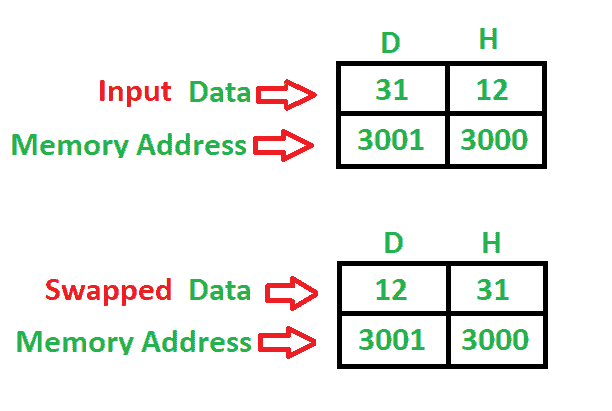

# 8085 程序使用直接寻址模式交换两个 8 位数字

> 原文: [https://www.geeksforgeeks.org/8085-program-swap-two-8-bit-numbers-using-direct-addressing-mode/](https://www.geeksforgeeks.org/8085-program-swap-two-8-bit-numbers-using-direct-addressing-mode/)

## 问题
编写一个程序，使用直接寻址模式交换两个 8 位数字，其中起始地址为 `2000`，第一个 8 位数字存储在 `3000` 中，第二个 8 位数字存储在 `3001` 存储地址中。

## 示例

## 算法
1.  将 8 位数字从存储器 `3000` 加载到累加器中。
2.  将累加器的值移入寄存器 `H`。
3.  将 8 位数字从存储器 `3001` 加载到累加器中。
4.  将累加器的值移入寄存器 `D`。
5.  交换两个寄存器对。
6.  停止。

## 程序

| 记忆地址 | 助记符 | 操作数 | 注释 |
| :--- | :--- | :--- | :--- |
| `2000` | `LDA` | `[3000]` | `[A]` |
| `2003` | `MOV` | `H, A` | `[H]` |
| `2004` | `LDA` | `[3001]` | `[A]` |
| `2007` | `MOV` | `D, A` | `[D]` |
| `2008` | `XCHG` | | `[H-L] <-> [D-E]` |
| `2009` | `HLT` | | 停止 |

## 说明
寄存器 `A`、`H`、`D` 用于通用。

1.  `LDA` 使用 16 位地址（3 字节指令）直接加载累加器。
2.  `MOV` 用于传输数据（1 字节指令）。
3.  `XCHG` 用于交换两个寄存器对 (`H-L`)、(`D-E`) 的数据（1 字节指令）。
4.  `HLT` 用于暂停程序。