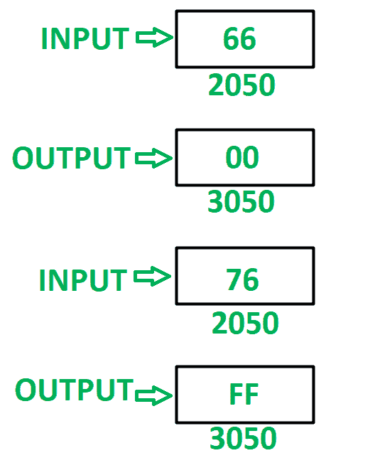

# 8085 程序检查 8 位数字的两个半字节是否相等

> 原文: [https://www.geeksforgeeks.org/8085-program-to-check-whether-both-the-nibbles-of-8-bit-number-are-equal-or-not/](https://www.geeksforgeeks.org/8085-program-to-check-whether-both-the-nibbles-of-8-bit-number-are-equal-or-not/)

## 问题
在 8085 微处理器中编写汇编语言程序，检查 8 位数字的两个半字节是否相等。如果半字节相等，则在存储单元 `3050` 中存储 `00`，否则在存储单元 `3050` 中存储 `FF`。

## 示例

## 假设
检查相似半字节的数字存储在存储器位置 `2050`。

## 算法
1.  在 `A` 中加载内存位置 `2050` 的内容。
2.  在 `B` 中移动 `A` 的内容。
3.  屏蔽下半字节，并将其存储在寄存器 `C` 中。
4.  在 `A` 中移动 `B` 的内容。
5.  屏蔽高阶半字节并将其存储在 `A` 中。
6.  使用 `RLC` 指令反转 `A` 的内容 4 次。
7.  借助 `CMP` 指令比较 `A` 和 `C` 的内容。更新 8085 的标志。
8.  如果 `ZF = 0`，现在存储 `FF`，否则如果 `ZF = 1`，则存储 `00`。
9.  将最终结果存储在存储单元 `3050` 中。

## 程序
`【jmp 201A】` `【跳转到记忆位置 201 a】`

| 存储地址 | 记忆术 | 评论 |
| :--- | :--- | :--- |
| `2000` | `LDA 2050` | `A<-M【2050】` |
| `2003` | `MOV B，A` | `B < - A` |
| `2004` | `ANI 0F` | `A < - A(与)0F` |
| `2006` | `MOV C，A` | `C < - A` |
| `2007` | `MOV A，B` | `A < - B` |
| `2008` | `ANI F0` | `A < - A(与)0F` |
| `200A` | `RLC` | 将 `A` 的内容向左旋转一位不进位 |
| `200B` | `RLC` | 将 `A` 的内容向左旋转一位不进位 |
| `200C` | `RLC` | 将 `A` 的内容向左旋转一位不进位 |
| `200D` | `RLC` | 将 `A` 的内容向左旋转一位不进位 |
| `200E` | `CMP C` | `A–C` |
| `200F` | `JZ 2018` | 如果 `ZF = 1` 跳跃 |
| `2013` | `MVI A，FF` | `a<-ff` |
| `【2015】` | | |

## 说明
寄存器 `A`、`B`、`C` 用于通用。

1.  `LDA 2050`: 将内存位置 `2050` 的内容加载到累加器 `A` 中。
2.  `MOV B，A`: 移动寄存器 `B` 中 `A` 的内容。
3.  `ANI 0F`: 在 `A` 和 `0F` 的内容中执行与运算。将结果存储在 `A` 中。
4.  `MOV C，A`: 移动寄存器 `C` 中 `A` 的内容。
5.  `MOV A，B`: 移动 `A` 中 `B` 的内容。
6.  `ANI F0`: 在 `A` 和 `F0` 的内容中进行与运算。将结果存储在 `A` 中。
7.  `RLC`: 将 `A` 的内容向左旋转一位，不进位。使用指令 4 次反转数字。
8.  `CMP C`: 比较 `A` 和 `C` 的内容，相应更新 8085 的标志。
9.  `JZ 2018`: 如果设置了零标志，则跳转到存储位置 `2018`。
10. `MVI A，FF`: 给 `A` 分配 `FF`。
11. `JMP 201A`: 跳转到内存位置 `201A`。
12. `MVI A，00`: 给 `A` 分配 `00`。
13. `STA 3050`: 将 `A` 的内容存储在存储单元 `3050` 中。
14. `HLT`: 停止执行程序并停止任何进一步的执行。