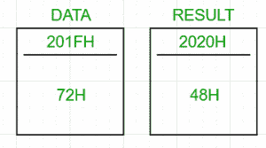

# 8085 程序将一个 BCD 数转换为二进制

> 原文: [https://www.geeksforgeeks.org/8085-program-to-convert-a-bcd-number-to-binary/](https://www.geeksforgeeks.org/8085-program-to-convert-a-bcd-number-to-binary/)

## 问题
用 8085 微处理器编写一个汇编语言程序，将一个 2 位数的 BCD 数转换成它的二进制等价数。

## 示例
```
Input : 72H (0111 0010)2
Output : 48H (in hexadecimal) (0011 0000)2
((4x16)+(8x1))=72
```



## 算法
1.  将 BCD 号装入累加器
2.  将 2 位数的 BCD 号码解包为两个独立的数字。让左边的数字为 `BCD1`，右边的数字为 `BCD2`
3.  将 `BCD1` 乘以 10，再加上 `BCD2`

如果 2 位 BCD 数是 72，那么它的二进制等价物将是
7×`0AH`+2 = `46H`+2 = `48H`

## 步骤
1.  将 BCD 号从存储位置(`201FH`，任意选择)加载到累加器中
2.  将累加器的值暂时存储在 `B` 中
3.  通过用 `0FH` 对累加器求 and 得到 `BCD2`，并将其存储在 `C` 中
4.  通过将 `B` 中的值移动到 `A` 中来恢复累加器的原始值，并将累加器与 `F0H` 进行比较
5.  如果累加器中的值等于 0，则 `BCD2` 是最终答案，并将其存储在存储位置 `2020H`(任意)
6.  否则，向右移动累加器 4 次，获得 `BCD1`。下一步是将 `BCD1` 乘以 `0AH`
7.  乘法:将 `BCD1` 移至 `D`，以 `0AH` 为计数器初始化 `E`。将累加器清零，并将 `D` 加到 `E`，次数为
8.  最后，在累加器中加入 `C`，并将结果存储在 `2020H` 中

`2020H` 包含结果。

```
地址      标签          记忆的
2000H                 LDA 201FH
2001H
2002H
2003H                 MOV B，A
2004H                 ANI 0FH
2005H
2006H                 MOV C，A
2007H                 MOV A，B
2008H                 ANI F0H
2009H
200AH                 JZ SKIPMULTIPLY
200BH
200CH
200DH                 （Ladyofthe）RoyalRedCross（英国）皇家护士红十字勋章（获得者）
200EH                 （Ladyofthe）RoyalRedCross（英国）皇家护士红十字勋章（获得者）
200FH                 （Ladyofthe）RoyalRedCross（英国）皇家护士红十字勋章（获得者）
2010H                 （Ladyofthe）RoyalRedCross（英国）皇家护士红十字勋章（获得者）
2011H                 MOV D，A
2012H                 XRA A
2013H                 MVI E， 0AH
2014H
2015H SUM             INR A
2016H                 DCR E
2017H                 JNZ SUM
2018H
2019H
201AH SKIPMULTIPLY    ADD C
201BH                 STA 2020H
201CH
201DH
201EH                 HLT
```

将 BCD 号存储在 `201FH` 中。`2020H` 包含它的二进制等价物。