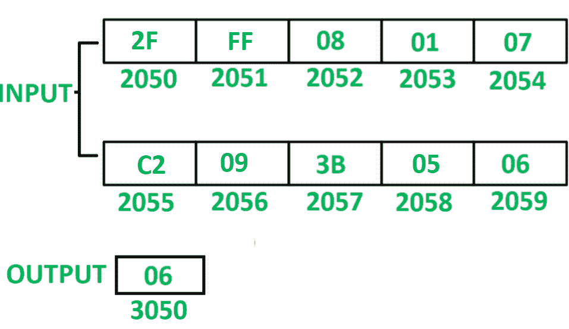

# 8085 编程计数小于 0A 的元素数量

> 原文: [https://www.geeksforgeeks.org/8085-program-to-count-number-of-elements-which-are-less-than-0a/](https://www.geeksforgeeks.org/8085-program-to-count-number-of-elements-which-are-less-than-0a/)

## 问题
在 8085 微处理器中编写汇编语言程序，对 10 个数串中小于 0A 的元素个数进行计数。

## 示例

## 假设
从起始存储位置 2050 开始存储 10 个数字的序列。计数值存储在存储器位置 3050。

## 算法
1. 用 20 初始化寄存器 H，用 4F 初始化寄存器 L，以便间接存储器指向存储单元 204F。
2. 用 00 初始化寄存器 C，用 0A 初始化寄存器 D。
3. 将间接内存增加 01。
4. 移动累加器 a 中 M 的内容。
5. 借助 `CPI` 指令对比 A 与 0A 的含量。该指令将更新 8085 的标志。
6. 检查是否设置了进位标志，如果为真，则将 C 的内容增加 01。
7. D 的内容减少 01。
8. 检查是否重置了零标志，如果是，则跳至步骤 3。
9. 把 C 的内容移到 a。
10. 将 A 的内容存储到内存位置 3050。

## 程序
| 存储地址 | 记忆术 | 评论 |
| :--- | :--- | :--- |
| 2000 | `LXI H 204F` | `H <- 20，L <- 4F` |
| 2003 | `MVI C, 00` | `C <- 00` |
| 2005 | `MVI D, 0A` | `D <- 0A` |
| 2007 | `INX H` | `M <- M + 01` |
| 2008 | `MOV A, M` | `A <- M` |
| 2009 | `CPI 0A` | `A–0A` |
| 200B | `JNC 200F` | 如果 CY = 0 则跳转 |
| 200E | `INR C` | `C <- C + 01` |
| 200F | `DCR D` | `D <- D–01` |
| 2010 | `JNZ 2007` | 如果 ZF = 0 则跳转 |
| 2013 | `MOV A, C` | `A <- C` |
| 2014 | `STA 3050` | `M[3050] <- A` |
| 2017 | `HLT` | 结束 |

## 说明
寄存器 A、C、D、H、L 用于通用。

1.  `LXI H 204F`: 给寄存器 H 分配 20，给寄存器 L 分配 4F。
2.  `MVI C, 00`: 将 00 分配给寄存器 C。
3.  `MVI D, 0A`: 将 0A 分配给寄存器 D。
4.  `INX H`: 将间接存储器位置增加 01。
5.  `MOV A, M`: 将间接存储器位置 M 的内容移动到累加器 A。
6.  `CPI 0A`: 从 A 的内容中减去 0A，更新标志 8085。
7.  `JNC 200F`: 如果 CY = 0，则跳转到存储器位置 200F。
8.  `INR C`: C 含量增加 01。
9.  `DCR D`: D 含量减少 01。
10. `JNZ 2007`: 如果 ZF = 0，跳转到内存位置 2007。
11. `MOV A, C`: 将 C 的内容移动到 A。
12. `STA 3050`: 将 A 的内容存储在存储单元 3050 中。
13. `HLT`: 停止执行程序并停止任何进一步的执行。