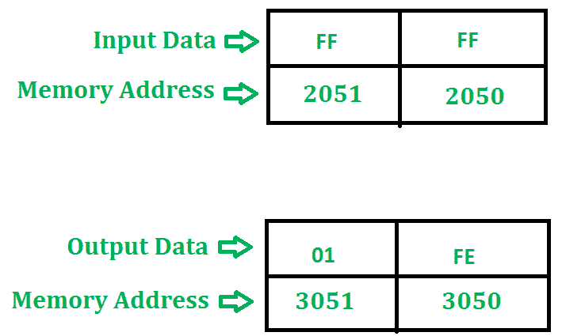

# 8085 程序划分两个 8 位数字

> 原文: [https://www.geeksforgeeks.org/8085-program-to-divide-two-8-bit-numbers/](https://www.geeksforgeeks.org/8085-program-to-divide-two-8-bit-numbers/)

## 问题
编写 8085 程序，对两个 8 位数字进行除法运算。

## 示例

## 算法
1.  通过加载带有存储单元地址的 `HL` 对寄存器来启动程序。
2.  将数据移到 `B` 寄存器。
3.  将第二个数据载入累加器。
4.  比较这两个数字来检查进位。
5.  减去两个数字。
6.  增加进位值。
7.  检查重复减法是否结束。
8.  然后将结果（商和余数）存储在给定的内存位置。
9.  终止程序。

## 程序

| 地址 | 记忆术 | 评论 |
| --- | --- | --- |
| 2000 | `LXI H, 2050` |  |
| 2003 | `MOV B, M` | `B` |
| 2004 | `MVI C, 00` | `C` |
| 2006 | `INX H` |  |
| 2007 | `MOV A, M` | `A` |
| 2008 | `CMP B` |  |
| 2009 | `JC 2011` | 检查进位 |
| 200C | `SUB B` | `A-B` |
| 200D | `INR C` | `C` |
| 200E | `JMP 2008` |  |
| 2011 | `STA 3050` | 3050 |
| 2014 | `MOV A, C` | `A` |
| 2015 | `STA 3051` | 3051 |
| 2018 | `HLT` | 终止程序 |

## 说明
寄存器 `A`、`H`、`L`、`C`、`B` 用于通用。

1.  `LXI H, 2050` 将用存储单元的地址 `2050` 加载 `HL` 对寄存器。
2.  `MOV B, M` 将内存内容复制到寄存器 `B` 中。
3.  `MVI C, 00` 分配 `00` 给 `C`。
4.  `INX H` 递增寄存器对 `HL`。
5.  `MOV A, M` 将内存内容复制到累加器中。
6.  `CMP B` 比较累加器和寄存器 `B` 的内容。
7.  `JC 2011` 如果设置了进位标志，跳转到地址 `2011`。
8.  `SUB B` 用寄存器 `B` 减去累加器的内容，并将结果存入累加器。
9.  `INR C` 增加寄存器 `C`。
10. `JMP 2008` 控制将转移到内存地址 `2008`。
11. `STA 3050` 将剩余部分存储在存储器位置 `3050`。
12. `MOV A, C` 将寄存器的内容复制到累加器中。
13. `STA 3051` 将商存储在存储器位置 `3051`。
14. `HLT` 停止执行程序，并停止任何进一步的执行。