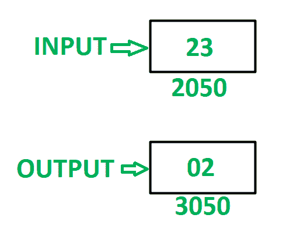

# 8085 程序以 8 位数的半字节执行“与”运算

> 原文: [https://www.geeksforgeeks.org/8085-program-to-perform-and-operation-in-nibbles-of-8-bit-number/](https://www.geeksforgeeks.org/8085-program-to-perform-and-operation-in-nibbles-of-8-bit-number/)

## 问题
在 8085 微处理器中编写汇编语言程序，在 8 位数字的低位半字节和高位半字节之间执行“与”操作。

## 示例


## 假设
8 位数字存储在存储器位置 `2050`。最终结果存储在存储器位置 `3050`。

## 算法
1.  在 `A` 中加载内存位置 `2050` 的内容。
2.  对半字节进行屏蔽。将低位半字节存储在 `B` 中，高位半字节存储在 `A` 中。
3.  借助 `ANA` 指令，执行 `A` 和 `B` 之间的“与”运算。
4.  将最终结果存储在存储单元 `3050` 中。

## 程序
```
存储地址 | 记忆术 | 评论
--- | --- | ---
2000 | LDA 2050 | A <- M[2050]
2003 | ANI 0F | A <- A(与)0F
2005 | MOV B，A | B <- A
2006 | LDA 2050 | A <- M[2050]
2009 | ANI F0 | A <- A(与)F0
200B | RLC | 将累加器向左旋转一位，不进位
200C | RLC | 将累加器向左旋转一位，不进位
200D | RLC | 将累加器向左旋转一位，不进位
200E | RLC | 将累加器向左旋转一位，不进位
200F | ANA B | A <- A(与)B
2010 | STA 3050 | M[3050] <- A
2013 | HLT | 结束
```

## 说明
寄存器 `A`、`B` 用于通用。

1.  `LDA 2050`: 将内存位置 `2050` 的内容加载到累加器 `A` 中。
2.  `ANI 0F`: 在 `A` 和 `0F` 中执行 `AND` 操作。将结果存储在 `A` 中。
3.  `MOV B，A`: 移动寄存器 `B` 中 `A` 的内容。
4.  `LDA 2050`: 将内存位置 `2050` 的内容加载到累加器 `A` 中。
5.  `ANI F0`: 在 `A` 和 `F0` 中执行“与”运算。将结果存储在 `A` 中。
6.  `RLC`: 将 `A` 的内容向左旋转一位，不进位。使用此指令 4 次，反转 `A` 的内容。
7.  `ANA B`: 在 `A` 和 `B` 中执行 `AND` 运算，将结果存储在 `A` 中。
8.  `STA 3050`: 将 `A` 的内容存储在存储单元 `3050` 中。
9.  `HLT`: 停止执行程序并停止任何进一步的执行。