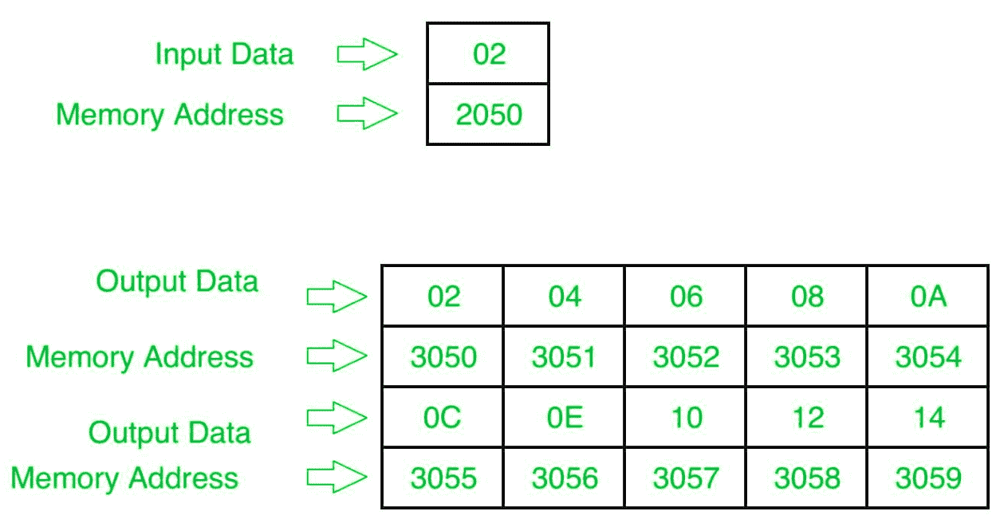

# 8085 程序打印输入整数的表格

> 原文: [https://www.geeksforgeeks.org/8085-program-to-print-the-table-of-input-integer/](https://www.geeksforgeeks.org/8085-program-to-print-the-table-of-input-integer/)

## 问题
用 8085 编写汇编语言程序，打印输入整数的表格。

## 假设
假设输入的数字在存储位置 `2050`，表格将从起始位置 `3050` 打印。

## 示例

## 算法
1.  从存储单元 `2050` 加载累加器中的输入值，然后将其复制到另一个寄存器，比如 `D`。也将 `0A` 存储在寄存器 `B` 中。
2.  使用 `LXI` 指令将存储单元 `3050` 存储在 `M` 中，并取另一个值为 `00` 的寄存器，比如 `C`。
3.  现在把 `D` 寄存器的内容复制到 `A`，加上 `A` 和 `C` 的内容，存储在 `A`，然后复制到 `M`。
4.  将 `M` 的值增加 `1`。
5.  将 `A` 的内容复制到 `C`，并将 `B` 的内容减 `1`，如果其值为 `0`，则暂停，否则再次转到步骤 3。

## 程序

| 地址 | 记忆术 | 评论 |
| --- | --- | --- |
| `2000` | `LDA 2050` | `A` |
| `2003` | `MOV D,A` | `D` |
| `2004` | `MVI B,0A` | `B` |
| `2006` | `LXI H,3050` | `HL` |
| `2009` | `MVI C,00` | `C` |
| `200B` | `MOV A,D` | `A` |
| `200C` | `ADD C` | `A` |
| `200D` | `MOV M,A` | `M` |
| `200E` | `INX H` | `HL` |
| `200F` | `MOV C,A` | `C` |
| `2010` | `DCR B` | `B` |
| `2011` | `JNZ 200B` | 如果 `ZF=0`，跳转到地址 `200B` |
| `2014` | `HLT` | 终止程序 |

## 解释
1.  **`LDA 2050`**: 将内容从 `2050` 内存位置加载到累加器(寄存器 `A`)。
2.  **`MOV D,A`**: 将累加器的内容移到寄存器 `D`。
3.  **`MVI B,0A`**: 将 `0A` 数据存入寄存器 `B`。
4.  **`LXI H,3050`**: 在 `H` 寄存器中存储 `30`，在 `L` 寄存器中存储 `50`，因此 `M` 将包含 `3050`。
5.  **`MVI C,00`**: 在寄存器 `C` 中存储 `00` 数据。
6.  **`MOV A,D`**: 将 `D` 寄存器的内容移入 `A`。
7.  **`ADD C`**: 将 `A` 和 `C` 寄存器的内容相加，存入 `A`。
8.  **`MOV M,A`**: 将 `A` 寄存器的内容移入 `M`。
9.  **`INX H`**: 将 `M` 的含量增加 `1`。
10. **`MOV C,A`**: 将 `A` 寄存器的内容移入 `C`。
11. **`DCR B`**: 将 `B` 寄存器的内容递减 `1`。
12. **`JNZ 200B`**: 如果进位标志不为零，跳转到地址 `200B`。
13. **`HLT`**: 终止程序。