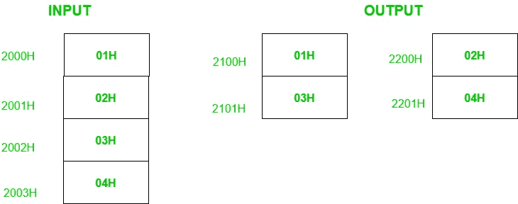

# 8085 从给定的数字列表中分离奇数和偶数编号的程序

> 原文: [https://www.geeksforgeeks.org/8085-program-to-separate-odd-and-even-nos-from-a-given-list-of-numbers/](https://www.geeksforgeeks.org/8085-program-to-separate-odd-and-even-nos-from-a-given-list-of-numbers/)

## 问题
在 8085 微处理器中编写汇编语言程序，从给定的 50 个数列表中分离出奇数和偶数。从内存位置 `2100H` 开始，将奇数编号存储在另一个列表中。从内存位置 `2200H` 开始，将偶数编号存储在另一个列表中。列表的起始地址是 `2000H`。

## 示例

## 解释
如果一个数的最低有效位为 1，则称该数为奇数，否则为偶数。因此，为了识别数字是偶数还是奇数，我们借助 `ANI` 指令对 `01` 进行与运算。如果这个数是奇数，那么我们将在累加器中得到 `01` 或 `00`。`ANI` 指令也会影响 8085 的标志。因此，如果累加器包含 `00`，则置零标志，否则复位。

## 算法
1.  加载 `HL` 寄存器对中的存储单元 `2000`。
2.  加载存储奇数的 `DE` 寄存器对中的存储单元 `2100`。
3.  将元素数量存储在寄存器 `C` 中。
4.  将列表中的下一个数字移到累加器。
5.  用 `01H` 执行“与”运算，检查数字是偶数还是奇数。
6.  如果是偶数，跳到第 9 步。
7.  获取累加器中的数字，并存储在 `DE` 所指向的内存位置。
8.  增量 `DE`。
9.  增量 `HL`。减量 `C`。
10. 如果 `C` 不为零，跳到步骤 4。

对存储偶数执行类似的上述步骤。

## 程序
| 存储单元 | 记忆术 | 评论 |
| --- | --- | --- |
| `2000H` | `LXI H, 2000H` | 初始化内存指针 1 |
| `2003H` | `LXI D, 2100H` | 初始化内存指针 2 |
| `2006H` | `MVI C, 32H` | 初始化计数器 |
| `2008H` | `MOV A, M` | 拿到号码 |
| `2009H` | `ANI 01H` | 检查奇数 |
| `200BH` | `JNZ 2011H` | 如果是偶数，不要存储 |
| `200EH` | `MOV A, M` | 拿到号码 |
| `200FH` | `STAX D` | 将数字存储在结果列表中 |
| `2010H` | `INX D` | 增量指针 2 |
| `2011H` | `INX H` | 增量指针 l |
| `2012H` | `DCR C` | 减量计数器 |
| `2013H` | `JNZ 2008H` | 如果不是零，重复 |
| `2016H` | `LXI H, 2000H` | 初始化内存指针 l |
| `2019H` | `LXI D, 2200H` | 初始化内存指针 2 |
| `201CH` | `MVI C, 32H` | 初始化计数器 |
| `201EH` | `MOV A, M` | 拿到号码 |
| `201FH` | `ANI 01H` | 检查偶数 |
| `2021H` | `JNZ 2027H` | 如果是奇数，不要储存 |
| `2024H` | `MOV A, M` | 拿到号码 |
| `2025H` | `STAX D` | 将数字存储在结果列表中 |
| `2026H` | `INX D` | 增量指针 2 |
| `2027H` | `INX H` | 增量指针 l |
| `2028H` | `DCR C` | 减量计数器 |
| `2029H` | `JNZ 201EH` | 如果不是零，重复 |
| `202CH` | `HLT` | 停止 |