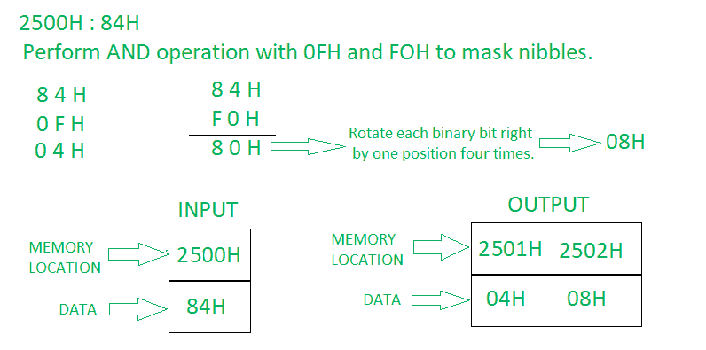

# 8085 程序将一个字节分成两个半字节

> 原文: [https://www.geeksforgeeks.org/8085-program-to-separate-or-split-a-byte-into-two-nibbles/](https://www.geeksforgeeks.org/8085-program-to-separate-or-split-a-byte-into-two-nibbles/)

## 问题
在 8085 微处理器中编写汇编语言程序，将一个字节拆分为两个半字节，并将结果存储在 `2001H` 和 `2002H` 中。

## 示例

## 算法
1.  将内存位置 `2500` 的内容加载到累加器 `A` 中。
2.  现在我们将对累加器和 `0FH` 的内容执行“与”运算。
3.  使用 `STA`，我们现在将结果存储在 `2501H` 存储位置。
4.  使用 `LDA`，我们将在累加器中加载 `2500H` 的内容。
5.  再次执行“与”操作，将另一个半字节即“与”操作与累加器和 `F0H` 的内容分开。
6.  现在将累加器中的每个位向右旋转一个位置，并重复此步骤四次。
7.  现在使用 `STA`，我们将在 `2502H` 内存位置存储另一个半字节。

## 程序

| 存储地址 | 记忆术 | 评论 |
| --- | --- | --- |
| `2000H` | `LDA 2500H` | `A <- M[2500]` |
| `2003H` | `ANI 0FH` | `A <- A AND 0FH` |
| `2005H` | `STA 2501H` | `M[2501] <- A` |
| `2008H` | `LDA 2500H` | `A <- M[2500]` |
| `200BH` | `ANI F0H` | `A <- A AND F0H` |
| `200DH` | `RRC` | 向右旋转一个位置 |
| `200EH` | `RRC` | 向右旋转一个位置 |
| `200FH` | `RRC` | 向右旋转一个位置 |
| `2010H` | `RRC` | 向右旋转一个位置 |
| `2011H` | `STA 2502H` | `M[2502] <- A` |
| `2014H` | `HLT` | 停止程序。 |

## 解释
- **`RRC`**：累加器的每个二进制位向右旋转一个位置。位 `D0` 被放置在 `D7` 的位置以及进位标志中。`CY` 根据位 `D0` 进行修改。
1.  **`LDA 2500H`**：加载累加器 `A` 中存储单元 `2500` 的内容。
2.  **`ANI 0FH`**：用累加器和 `0FH` 的内容执行“与”操作。
3.  **`STA 2501H`**：将累加器的内容存储到存储器位置 `2501H`。
4.  **`LDA 2500H`**：加载累加器 `A` 中存储单元 `2500` 的内容。
5.  **`ANI F0H`**：用累加器和 `F0H` 的内容执行“与”操作。
6.  **`RRC`**：将累加器中的每个位向右旋转一个位置。
7.  **`RRC`**：将累加器中的每个位向右旋转一个位置。
8.  **`RRC`**：将累加器中的每个位向右旋转一个位置。
9.  **`RRC`**：将累加器中的每个位向右旋转一个位置。
10. **`STA 2502H`**：将累加器的内容存储到存储单元 `2502H`。
11. **`HLT`**：停止程序执行。