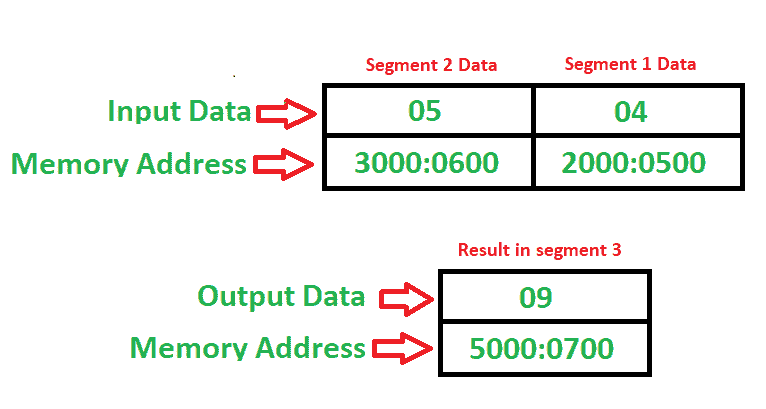

# 8086 程序将一个片段的内容添加到另一个片段

> 原文: [https://www.geeksforgeeks.org/8086-program-add-content-one-segment-another-segment/](https://www.geeksforgeeks.org/8086-program-add-content-one-segment-another-segment/)

## 问题
编写一个程序，将内存位置 `2000:0500` 的内容与内存位置 `3000:0600` 的内容相加，并将结果存入 `5000:0700` 内存位置。

## 示例

## 算法
1.  将 `2000` 移入 `CX` 寄存器。
2.  将 `CX` 移动到 `DS` 段寄存器（现在我们处于 `2000` 数据段）。
3.  将值 `500` 移入 `AX` 寄存器。
4.  将 `3000` 移入 `CX` 寄存器。
5.  将 `CX` 移动到 `DS` 段寄存器（现在我们处于 `3000` 数据段）。
6.  将 `AX`（累加器）的值与存储器 `[600]` 中的值相加。
7.  将 `5000` 移入 `CX` 寄存器。
8.  将 `CX` 移动到 `ES` 段寄存器（现在我们在 `5000` 附加段）。
9.  将 `AX` 的内容移动到 `[700]` 内存位置。
10. 停止。

## 程序
| 记忆地址 | 助记符 | 操作数 | 注释 |
| --- | --- | --- | --- |
| `1000` | `MOV` | `CX, 2000` | `[CX] ← 2000` |
| `1004` | `MOV` | `DS, CX` | `[DS] ← [CX]` |
| `1006` | `MOV` | `AX, [500]` | `[AX] ← [500]` |
| `100A` | `MOV` | `CX, 3000` | `[CX] ← 3000` |
| `100E` | `MOV` | `DS, CX` | `[DS] ← [CX]` |
| `1010` | `ADD` | `AX, [600]` | `[AX] ← [AX] + [600]` |
| `1014` | `MOV` | `CX, 5000` | `[CX] ← 5000` |
| `1018` | `MOV` | `ES, CX` | `[ES] ← [CX]` |
| `101A` | `MOV` | `[700], AX` | `[700] ← [AX]` |
| `101E` | `HLT` | | 停止 |

## 解释
寄存器使用 `AX`，`CX` 通用。
段寄存器使用 `DS`、`ES` 来改变段。
`MOV` 用于传输数据。
`ADD` 用于相加。
`HLT` 用于暂停程序。