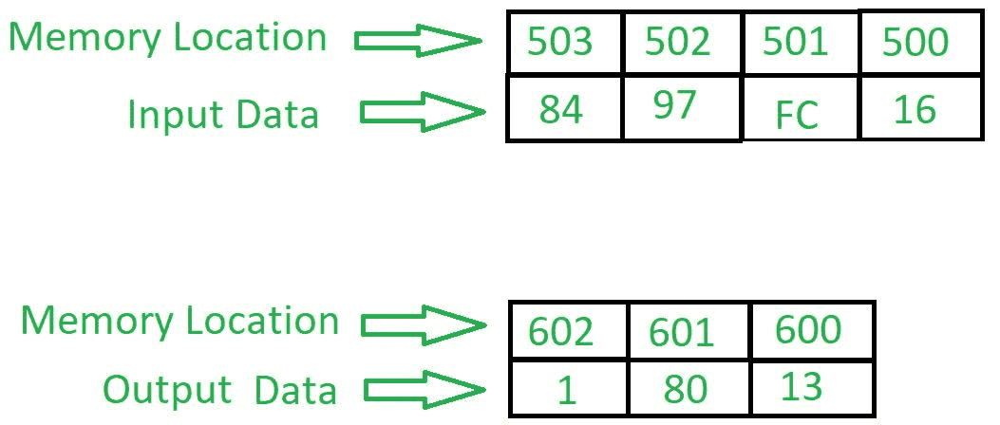

# 8086 程序添加两个带进位的 16 位 BCD 号

> 原文：[https://www.geeksforgeeks.org/8086-program-add-two-16-bit-bcd-numbers-carry/](https://www.geeksforgeeks.org/8086-program-add-two-16-bit-bcd-numbers-carry/)

## 问题
编写一个汇编语言程序，在 8086 微处理器中用进位加两个 16 位 BCD 数。

## 示例


## 算法
1.  在不同位置加载两个 16 位 BCD 号的下部。
2.  将每个数字的下半部分相加。
3.  通过添加进位(如果有)重复上述步骤。
4.  将寄存器 `00` 的下部加上进位。这样做是为了获得进位。
5.  显示所有数字，最高部分为进位，中间部分为高 BCD 8 位的相加，低部分为低 BCD 8 位。

## 程序
```
| 存储地址 | 记忆术 | 评论 |
| --- | --- | --- |
| 0400 | MOV AL, [500] | AL ← [500] |
| 0404 | MOV BL, [502] | BL ← [502] |
| 0408 | ADD AL, BL | AL+BL |
| 040A | DAA | 十进制调整 |
| 040B | MOV [600], AL | AL → [600] |
| 040F | MOV AL, [501] | AL ← [501] |
| 0413 | MOV BL, [503] | BL ← [503] |
| 0417 | ADC AL, BL | AL+BL+CY 进位 |
| 0419 | DAA | 十进制调整 |
| 041A | MOV [601], AL | AL → [601] |
| 041E | MOV AL, 00 | AL = 00 |
| 0420 | ADC AL, AL | 进位:1 |
| 0422 | MOV [602], AL | 进位:1 |
| 0426 | HLT | 停止执行 |
```

## 解释
1.  `MOV AL, [500]` 将存储在存储器位置 `500` 的值移动到 `AL` 寄存器。
2.  `MOV BL, [502]` 将存储在存储器位置 `502` 的值移动到 `BL` 寄存器。
3.  `ADD AL, BL` 将 `AL` 和 `BL` 寄存器中的值相加。
4.  `DAA` 在大于 9 的数字上加 6。
5.  `MOV [600], AL` 显示存储单元 `600` 的增加值。
6.  `MOV AL, [501]` 将存储在存储器位置 `501` 的值移动到 `AL` 寄存器。
7.  `MOV BL, [503]` 将存储在存储器位置 `503` 的值移动到 `BL` 寄存器。
8.  `ADC AL, BL` 将 `AL` 和 `BL` 寄存器中的值相加并进位(如果有)。
9.  `MOV BL, [503]` 将存储在存储器位置 `503` 的值移动到 `BL` 寄存器。
10. `MOV [601], AL` 显示存储单元 `601` 的增加值。
11. `MOV AL, 00` 在 `AL` 寄存器中移动 `00`。
12. `ADC AL, AL` 将 `AL` 和 `AL` 寄存器中的值相加并进位(如果有)。
13. `MOV [602], AL` 显示存储器位置 `602` 的增加值。
14. `HLT` 停止执行。

下一篇相关文章 – [8086 程序添加两个 8 位 BCD 号](https://www.geeksforgeeks.org/8086-program-add-two-8-bit-bcd-numbers/)