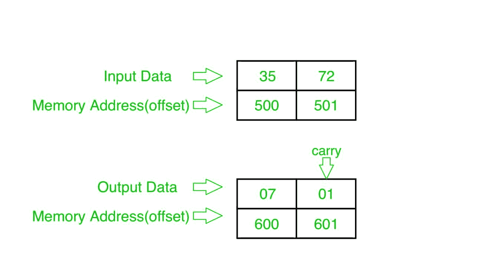

# 8086 程序添加两个 8 位 BCD 号

> 原文: [https://www.geeksforgeeks.org/8086-program-add-two-8-bit-bcd-numbers/](https://www.geeksforgeeks.org/8086-program-add-two-8-bit-bcd-numbers/)

## 问题

在 8086 微处理器中编写一个程序，找出两个 8 位 BCD 数的相加，其中数从起始内存地址 `2000:500` 开始存储，并将结果存储到内存地址 `2000:600`，在 `2000:601` 进位。

## 示例



## 算法

1.  将数据从偏移量 `500` 加载到寄存器 `AL`（第一个数字）。
2.  将数据从偏移量 `501` 加载到寄存器 `BL`（第二个数）。
3.  将这两个数字相加（寄存器 `AL` 和寄存器 `BL` 的内容）。
4.  应用 `DAA` 指令（十进制调整）。
5.  将结果（寄存器 `AL` 的内容）存储到偏移量 `600`。
6.  将寄存器 `AL` 设置为 `00`。
7.  用进位将寄存器 `AL` 的内容添加到自身。
8.  将结果（寄存器 `AL` 的内容）存储到偏移量 `601`。
9.  停止。

## 程序

```
存储地址    记忆术          评论
------------------------------------------------
0400        MOV AL, [500]   AL <- [500]
0404        MOV BL, [501]   BL <- [501]
0408        ADD AL, BL      AL <- AL + BL
040A        DAA             十进制调整 AL
040B        MOV [600], AL   AL -> [600]
040F        MOV AL, 00      AL <- 00
0411        ADC AL, AL      AL <- AL + AL + CY (预测)
0413        MOV [601], AL   AL -> [601]
0417        HLT             结束
```

## 解释

1.  **`MOV AL, [500]`**: 从偏移量 `500` 加载数据到寄存器 `AL`。
2.  **`MOV BL, [501]`**: 从偏移量 `501` 加载数据到寄存器 `BL`。
3.  **`ADD AL, BL`**: 添加寄存器 `AL` 和 `BL` 的内容。
4.  **`DAA`**: 小数调整 `AL`。
5.  **`MOV [600], AL`**: 存储寄存器 `AL` 到偏移量 `600` 的数据。
6.  **`MOV AL, 00`**: 将寄存器 `AL` 的值设置为 `00`。
7.  **`ADC AL, AL`**: 用进位将寄存器 `AL` 的内容加到 `AL` 上。
8.  **`MOV [601], AL`**: 存储寄存器 `AL` 到偏移量 `601` 的数据。
9.  **`HLT`**: 停止。