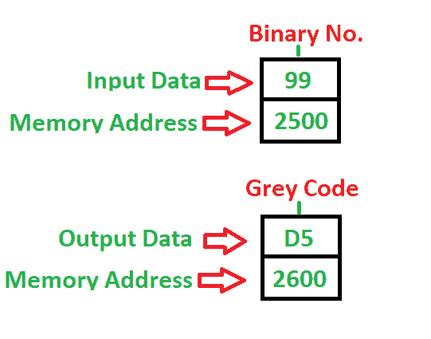

# 8086 程序将二进制转换为格雷码

> 原文：[https://www.geeksforgeeks.org/8086-program-convert-binary-grey-code/](https://www.geeksforgeeks.org/8086-program-convert-binary-grey-code/)

先决条件 – [二进制至/自格雷码](https://www.geeksforgeeks.org/digital-logic-code-converters-binary-gray-code/)

**问题 –** 编写程序将二进制数转换为格雷码 8 位数，其中起始地址为 `2000`，该数存储在 `2500` 内存地址，并将结果存储到 `2600` 内存地址。

**示例 –**

**算法 –**

1.  将 `[2500]` 处的值移入 `AL`
2.  将 `AL` 移入 `BL`
3.  逻辑右移一次
4.  将 `BL` 与 `AL` 异或（逻辑上）并存储到 `BL` 中
5.  将 `BL` 的内容移入 `2600`
6.  停止

**程序 –**

| 记忆地址 | 助记符 | 操作数 | 注释 |
| :--- | :--- | :--- | :--- |
| 2000 | `MOV` | `AL, [2500]` | `[2500]` |
| 2004 | `MOV` | `BL, AL` | `[BL]` |
| 2006 | `SHR` | `AL, 1` | 向右移动一次 |
| 2008 | `XOR` | `BL, AL` | `[BL]` |
| 200A | `MOV` | `[2600], BL` | `[2600]` |
| 200E | `HLT` | | 停止 |

**说明 –** 寄存器 `AL`、`BL` 用于通用目的

1.  `MOV` 用于传输数据
2.  `SHR` 用于向右（逻辑上）移位直到计数器不为零
3.  `XOR` 用于两个值的异或（逻辑上）
4.  `HLT` 用于暂停程序

参见 [8085 将二进制数转换为灰色的程序](https://www.geeksforgeeks.org/8085-program-convert-binary-numbers-gray/)