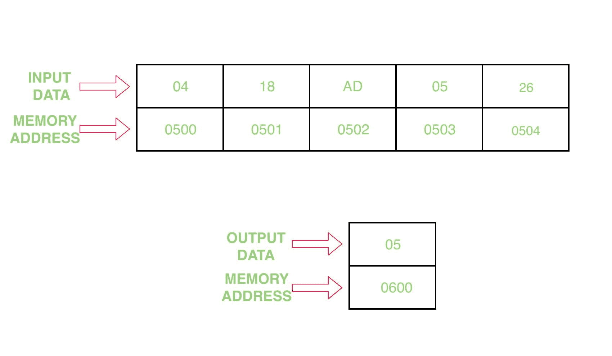

# 8086 程序寻找给定数组中的最小值

> 原文: [https://www.geeksforgeeks.org/8086-program-find-min-value-given-array/](https://www.geeksforgeeks.org/8086-program-find-min-value-given-array/)

`问题` – 编写一个程序，在汇编 8086 微处理器中找到给定数组的最小值

`示例` –

`假设` – 输入数组的起始地址为 `0500`，并将结果存储在地址 `0600`

`算法` –

1.  在 `SI` 中赋值 `500`，在 `DI` 中赋值 `600`
2.  在 `CL` 中移动 `[SI]` 的内容，并将 `SI` 增加 1
3.  将值 `00 H` 分配给 `CH`
4.  移动 `AL` 中 `[SI]` 的内容
5.  将 `CX` 值减少 1
6.  将 `SI` 值增加 1
7.  在 `BL` 中移动 `[SI]` 的内容
8.  比较 `BL` 和 `AL` 的值
9.  如果进位标志被设置，跳到步骤 11
10. 在 `AL` 中移动 `BL` 的内容
11. 跳到步骤 6，直到 `CX` 的值变为 0，并将 `CX` 减少 1
12. 在 `[DI]` 中移动 `AL` 的内容
13. 暂停程序

`程序` –

| 存储地址 | 记忆术 | 评论 |
| --- | --- | --- |
| `0400` | `MOV SI, 500` | `SI` |
| `0403` | `MOV DI, 600` | `DI` |
| `0406` | `MOV CL, [SI]` | `CL` |
| `0408` | `MOV CH, 00` | `CH` |
| `040A` | `INC SI` | `SI` |
| `040B` | `MOV AL, [SI]` | `AL` |
| `040D` | `DEC CX` | `CX` |
| `040E` | `INC SI` | `SI` |
| `040F` | `MOV BL, [SI]` | `BL` |
| `0411` | `CMP AL, BL` | `AL-BL` |
| `0413` | `JC 0417` | 进位为 1 时跳转 |
| `0415` | `MOV AL, BL` | `AL` |
| `0417` | `LOOP 040E` | 如果 `CX` 不等于 0，则跳转 |
| `0419` | `MOV [DI], AL` | `[DI]` |
| `041B` | `HLT` | 节目结束 |

`解释` –

1.  `MOV SI, 500` 指定 `500` 给 `SI`
2.  `MOV DI, 600` 分配 `600` 给 `DI`
3.  `MOV CL, [SI]` 将 `[SI]` 的内容移动到 `CL` 寄存器
4.  `MOV CH, 00` 将 `00` 分配给 `CH` 寄存器
5.  将值 `SI` 增加 1
6.  `MOV AL, [SI]` 将 `[SI]` 的内容移动到 `AL` 寄存器
7.  `DEC CX` 将 `CX` 登记册的内容减少 1
8.  将值 `SI` 增加 1
9.  `MOV BL, [SI]` 将 `[SI]` 的内容移动到 `BL` 寄存器
10. `CMP AL, BL` 从 `AL` 中减去 `BL` 寄存器的值，并修改标志寄存器
11. 如果进位标志被设置，`JC 0417` 跳转到 `0417` 地址
12. `MOV AL, BL` 将 `BL` 寄存器的内容移到 `AL` 寄存器
13. `LOOP 040E` 运行循环，直到 `CX` 不等于零，并将 `CX` 值减少 1
14. `MOV [DI], AL` 将 `AL` 的内容移动到 `[DI]`
15. `HLT` 停止程序的执行