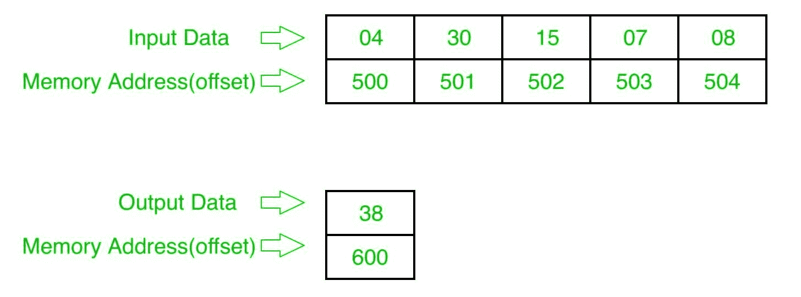

# 8086 程序求给定数列中偶数的和

> 原文:[https://www . geesforgeks . org/8086-program-find-sum-偶数-给定-数列/](https://www.geeksforgeeks.org/8086-program-find-sum-even-numbers-given-series/)

## 问题
在 8086 微处理器中编写一个程序，找出偶数系列的和，其中数字从起始偏移量 `500` 开始存储，结果存储在偏移量 `600`。

## 示例

## 算法
1.  给 `SI` 分配 `500`
2.  将数据从偏移 `SI` 加载到寄存器 `CL`(计数)，并将 `00` 分配给寄存器 `CH`。`INC SI` `1`
3.  从偏移 `SI` 加载数据，并用 `01` 进行测试，如果结果为非零，跳到步骤 `5`
4.  用寄存器 `AL` 添加偏移数据
5.  将偏移量增加 `1`
6.  循环至步骤 `3`
7.  将结果(寄存器 `AL` 的内容)存储到偏移量 `600`
8.  `HLT`

## 程序
| 存储地址 | 记忆术 | 评论 |
| --- | --- | --- |
| `400` | `MOV SI, 500` | `SI` |
| `403` | `MOV CL, [SI]` | `CL` |
| `405` | `INC SI` | `SI` |
| `406` | `MOV CH, 00` | `CH` |
| `408` | `MOV AL, 00` | `AL` |
| `40A` | `MOV BL, [SI]` | `BL` |
| `40C` | `TEST BL, 01` | `BL` 和 `01` |
| `40F` | `JNZ 413` | 如果不是零就跳 |
| `411` | `ADD AL, BL` | `AL` |
| `413` | `INC SI` | `SI` |
| `414` | `LOOP 40A` | 如果 `CX` 不是零，跳到 `40A` |
| `416` | `MOV [600], AL` | `AL` >`[600]` |
| `41A` | `HLT` | 结束 |

## 解释
1.  `MOV SI, 500:` 给 `SI` 分配 `500`
2.  `MOV CL, [SI]:` 从偏移 `SI` 向寄存器 `CL` 加载数据
3.  `INC SI:` `SI` 值增加 `1`
4.  `MOV CH, 00:` 分配 `00` 到寄存器 `CH`
5.  `MOV AL, 00:` 分配 `00` 到寄存器 `AL`
6.  `MOV BL, [SI]:` 从偏移 `SI` 向寄存器 `BL` 加载数据
7.  `TEST BL, 01:` 并用 `01` 测试寄存器 `BL`
8.  `JNZ 413:` 如果不为零，跳转到地址 `413`
9.  `ADD AL, BL:` 添加寄存器 `AL` 和 `BL` 的内容
10. `INC SI:` `SI` 值增加 `1`
11. `LOOP 40A:` 如果 `CX` 不为零，`CX=CX-1`，跳转到 `40A`
12. `MOV [600], AL:` 将寄存器 `AL` 的值存储到偏移 `600`
13. `HLT:` 结束。

参考–[8086 程序寻找给定序列中奇数的和](https://www.geeksforgeeks.org/8086-program-find-sum-odd-numbers-given-series/)