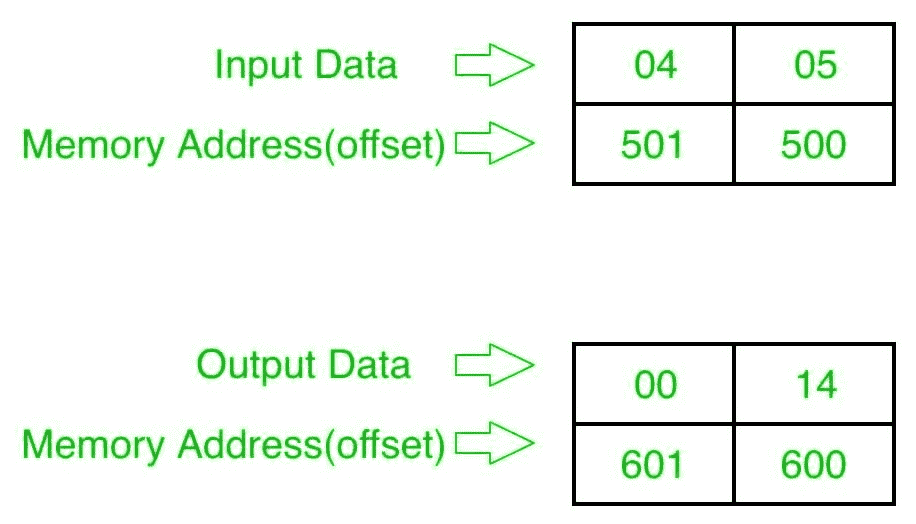

# 8086 程序将两个 8 位数字相乘

> 原文：[https://www.geeksforgeeks.org/8086-program-multiply-two-8-bit-numbers/](https://www.geeksforgeeks.org/8086-program-multiply-two-8-bit-numbers/)

## 问题
在 8086 微处理器中编写一个程序，将两个 8 位数字相乘，其中数字从偏移量 `500` 开始存储，并将结果存储到偏移量 `600` 中。

## 示例
输入和输出以十六进制表示。



## 算法
1.  将数据从偏移量 `500` 加载到寄存器 `AL`（第一个数字）。
2.  将数据从偏移量 `501` 加载到寄存器 `BL`（第二个数）。
3.  将它们相乘（`AX=AL*BL`）。
4.  将结果（寄存器 `AX` 的内容）存储到偏移量 `600`。
5.  停止。

## 程序
```
存储地址      记忆术          评论
-------------------------------------------------
400           MOV SI, 500     SI=500
403           MOV DI, 600     DI=600
406           MOV AL, [SI]    AL=[SI]
408           INC SI          SI=SI+1
409           MOV BL, [SI]    BL=[SI]
40B           MUL BL          AX=AL*BL
40D           MOV [DI], AX    AX >[DI]
40F           HLT             结束
```

## 解释
1.  `MOV SI, 500` 将 `500` 设置为 `SI`。
2.  `MOV DI, 600` 将 `600` 设置为 `DI`。
3.  `MOV AL, [SI]` 将偏移 `SI` 的内容加载到寄存器 `AL`。
4.  `INC SI` 将 `SI` 值增加 `1`。
5.  `MOV BL, [SI]` 将偏移 `SI` 的内容加载到寄存器 `BL`。
6.  `MUL BL` 将寄存器 `AL` 和 `BL` 的内容相乘。
7.  `MOV [DI], AX` 存储结果（寄存器 `AX` 的内容）到偏移 `DI`。
8.  `HLT` 结束。