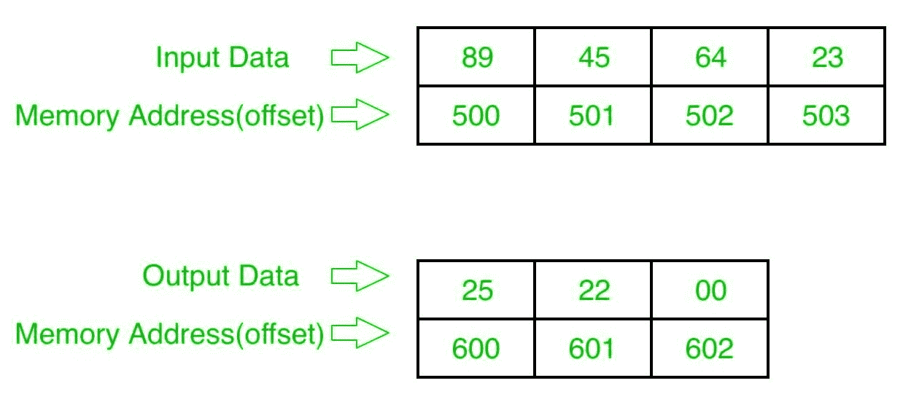

# 8086 程序减去两个 16 位 BCD 号

> 原文:[https://www . geesforgeks . org/8086-program-减法-二-16 位-bcd-numbers/](https://www.geeksforgeeks.org/8086-program-subtract-two-16-bit-bcd-numbers/)

先决条件–[8086 程序减去两个 8 位 BCD 数](https://www.geeksforgeeks.org/8086-program-subtract-two-8-bit-bcd-numbers/)

## 问题–
在 8086 微处理器中编写一个程序，找出两个 16 位 BCD 数的减法，其中数字从起始偏移量 `500` 开始存储，并将结果存储到偏移量 `600`。

## 示例–

## 算法–
1.  将数据从偏移量 `500` 加载到寄存器 `AL`
2.  将数据从偏移量 `502` 加载到寄存器 `BL`
3.  减去这两个数字（寄存器 `AL` 和寄存器 `BL` 的内容）
4.  应用 `DAS` 指令（十进制调整）
5.  将结果（寄存器 `AL` 的内容）存储到偏移量 `600`
6.  将数据从偏移量 `501` 加载到寄存器 `AL`
7.  将数据从偏移量 `503` 加载到寄存器 `BL`
8.  用借位减去这两个数字。（寄存器 `AL` 和寄存器 `BL` 的内容）
9.  应用 `DAS` 指令（十进制调整）
10. 将结果（寄存器 `AL` 的内容）存储到偏移量 `601`
11. 将寄存器 `AL` 设置为 `00`
12. 用进位将寄存器 `AL` 的内容添加到自身
13. 将结果（寄存器 `AL` 的内容）存储到偏移量 `602`
14. 停止

## 程序–
| 存储地址 | 记忆术 | 评论 |
| --- | --- | --- |
| `400` | `MOV AL, [500]` | `AL` |
| `404` | `MOV BL, [502]` | `BL` |
| `408` | `SUB AL, BL` | `AL` |
| `40A` | `DAS` | 小数调整 |
| `40B` | `MOV [600], AL` | `AL` >`[600]` |
| `40F` | `MOV AL, [501]` | `AL` |
| `413` | `MOV BL, [503]` | `BL` |
| `417` | `SBB AL, BL` | 借出 |
| `419` | `DAS` | 小数调整 |
| `41A` | `MOV [601], AL` | `AL` >`[601]` |
| `41E` | `MOV AL, 00` | -`00` 点 |
| `420` | `ADC AL, AL` | `AL` |
| `422` | `MOV [602], AL` | `AL`->`[602]` |
| `426` | `HLT` | 结束 |

## 解释–
1.  `MOV AL, [500]`: 从偏移量 `500` 加载数据到寄存器 `AL`
2.  `MOV BL, [502]`: 从偏移量 `502` 加载数据到寄存器 `BL`
3.  `SUB AL, BL`: 减去寄存器 `AL` 和 `BL` 的内容
4.  `DAS`: 小数调整
5.  `MOV [600], AL`: 存储从寄存器 `AL` 到偏移 `600` 的数据
6.  `MOV AL, [501]`: 从偏移量 `501` 加载数据到寄存器 `AL`
7.  `MOV BL, [503]`: 从偏移量 `503` 加载数据到寄存器 `BL`
8.  `SBB AL, BL`: 用借位减去寄存器 `AL` 和 `BL` 的内容
9.  `DAS`: 小数调整
10. `MOV [601], AL`: 存储从寄存器 `AL` 到偏移 `601` 的数据
11. `MOV AL, 00`: 将寄存器 `AL` 的值设置为 `00`
12. `ADC AL, AL`: 用进位将寄存器 `AL` 的内容加到 `AL` 上
13. `MOV [601], AL`: 存储从寄存器 `AL` 到偏移 `601` 的数据
14. `HLT`: 结束