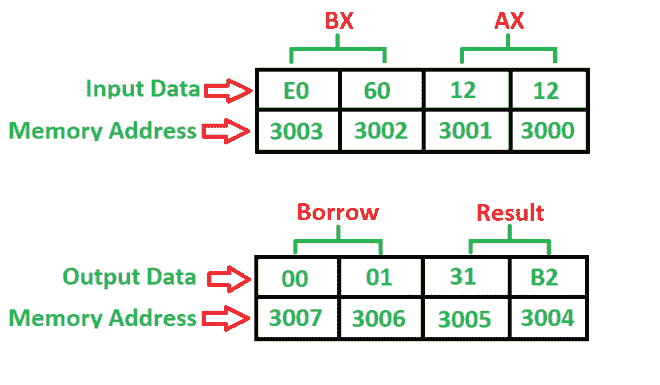

# 8086 程序减去两个 16 位数字有无借用

> 原文: [https://www.geeksforgeeks.org/8086-program-subtract-two-16-bit-numbers-without-borrow/](https://www.geeksforgeeks.org/8086-program-subtract-two-16-bit-numbers-without-borrow/)

## 问题
写一个程序减去两个 16 位数字，起始地址为 `2000`，数字位于 `3000` 和 `3002` 内存地址，并将结果存入 `3004` 和 `3006` 内存地址。

## 示例

## 算法
1.  将 `0000H` 载入 `CX` 寄存器（借位）
2.  将数据从存储器 `3000` 加载到 `AX`（累加器）中
3.  将数据从存储器 `3002` 载入 `BX` 寄存器
4.  用累加器 `AX` 减去 `BX`
5.  不借位则跳转
6.  将 `CX` 增加 1
7.  将数据从 `AX`（累加器）移动到内存 `3004`
8.  将数据从 `CX` 寄存器移动到存储器 `3006`
9.  停止

## 程序
| 地址 | 助记符 | 操作数 | 注释 |
| --- | --- | --- | --- |
| `2000` | `MOV` | `CX, 0000` | `[CX] <- 0000` |
| `2003` | `MOV` | `AX, [3000]` | `[AX] <- [3000]` |
| `2007` | `MOV` | `BX, [3002]` | `[BX] <- [3002]` |
| `200B` | `SUB` | `AX, BX` | `[AX] <- [AX] - [BX]` |
| `200D` | `JNC` | `2010` | 不借位则跳转 |
| `200F` | `INC` | `CX` | `[CX] <- [CX] + 1` |
| `2010` | `MOV` | `[3004], AX` | `[3004] <- [AX]` |
| `2014` | `MOV` | `[3006], CX` | `[3006] <- [CX]` |
| `2018` | `HLT` | | 停止 |

## 解释
1.  `MOV` 用于加载和存储数据。
2.  `SUB` 用于减去两个数字，其中一个数字在累加器中。
3.  `JNC` 是一个 2 字节命令，用于检查借位是否由累加器产生。
4.  `INC` 用于将寄存器增加 1。
5.  `HLT` 用于停止程序。
6.  `AX` 是一个累加器，用于加载和存储数据。
7.  `CX` 和 `BX` 是通用寄存器，其中 `BX` 用于存储第二个数字，`CX` 用于存储借位。