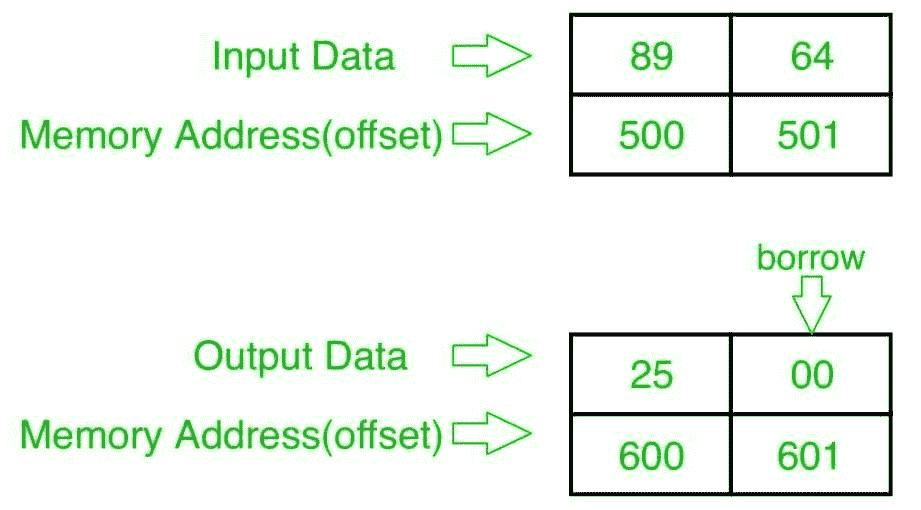

# 8086 程序减法两个 8 位 BCD 号

> 原文: [https://www.geeksforgeeks.org/8086-program-subtract-two-8-bit-bcd-numbers/](https://www.geeksforgeeks.org/8086-program-subtract-two-8-bit-bcd-numbers/)

## 问题
在 8086 微处理器中编写一个程序，找出两个 8 位 BCD 数的减法，从起始内存地址 `2000:500` 开始存储，结果存储到内存地址 `2000:600`，在 `2000:601` 进行进位(借位)。

## 示例

## 算法
1.  将数据从偏移量 `500` 加载到寄存器 `AL`(第一个数字)
2.  将数据从偏移量 `501` 加载到寄存器 `BL`(第二个数)
3.  减去这两个数字(寄存器 `AL` 和寄存器 `BL` 的内容)
4.  应用 `DAS` 指令(十进制调整)
5.  将结果(寄存器 `AL` 的内容)存储到偏移量 `600`
6.  将寄存器 `AL` 设置为 `00`
7.  用进位(借用)将寄存器 `AL` 的内容添加到自身
8.  将结果(寄存器 `AL` 的内容)存储到偏移量 `601`
9.  停止

## 程序
| 存储地址 | 记忆术 | 评论 |
| --- | --- | --- |
| `400` | `MOV AL, [500]` | `AL <- [500]` |
| `404` | `MOV BL, [501]` | `BL <- [501]` |
| `408` | `SUB AL, BL` | `AL <- AL - BL` |
| `40A` | `DAS` | 十进制调整 `AL` |
| `40B` | `MOV [600], AL` | `AL -> [600]` |
| `40F` | `MOV AL, 00` | `AL <- 00` |
| `411` | `ADC AL, AL` | `AL <- AL + AL + CY(借位)` |
| `413` | `MOV [601], AL` | `AL -> [601]` |
| `417` | `HLT` | 结束 |

## 解释
1.  `MOV AL, [500]` 从偏移量 `500` 加载数据到寄存器 `AL`。
2.  `MOV BL, [501]` 从偏移量 `501` 加载数据到寄存器 `BL`。
3.  `SUB AL, BL` 减去寄存器 `AL` 和 `BL` 的内容。
4.  `DAS` 小数调整 `AL`。
5.  `MOV [600], AL` 存储从寄存器 `AL` 到偏移 `600` 的数据。
6.  `MOV AL, 00` 将寄存器 `AL` 的值设置为 `00`。
7.  `ADC AL, AL` 通过借用将寄存器 `AL` 的内容添加到 `AL`。
8.  `MOV [601], AL` 存储从寄存器 `AL` 到偏移 `601` 的数据。
9.  `HLT` 结束。