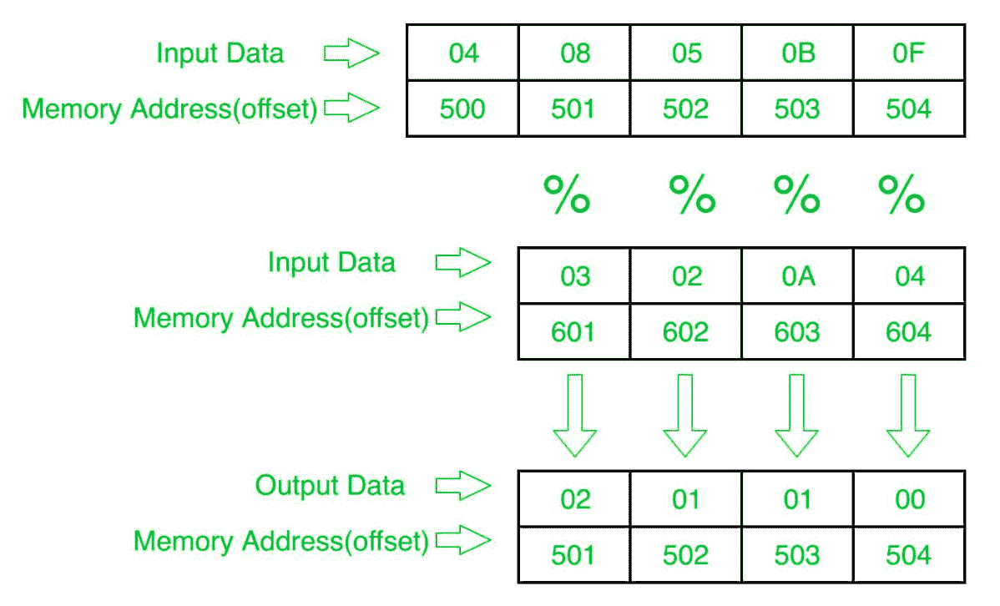

# 8086 程序确定第一个数组元素对应另一个数组元素的模数

> 原文：[https://www.geeksforgeeks.org/8086-program-to-determine-modulus-of-first-array-elements-corresponding-to-another-array-elements/](https://www.geeksforgeeks.org/8086-program-to-determine-modulus-of-first-array-elements-corresponding-to-another-array-elements/)

## 问题
在 8086 微处理器中编写一个程序，确定第一个数组的相应 8 位 n 个元素与第二个数组的 8 位 n 个数的模，其中大小“n”存储在偏移量 `500` 处，第一个数组的个数存储在偏移量 `501` 处，第二个数组的个数存储在偏移量 `601` 处，并将结果数存储到第一个数组即偏移量 `501` 处。

## 示例

## 算法
1.  将 `500` 存储到 `SI`，将 `601` 存储到 `DI`，并将来自偏移量 `500` 的数据加载到寄存器 `CL`，并将寄存器 `CH` 设置为 `00`（用于计数）。
2.  将 `SI` 值增加 `1`。
3.  从下一个偏移量（即 `501`）加载第一个数字（值）到寄存器 `AL`。
4.  在寄存器 `AH` 中存储 `00`。
5.  将寄存器 `AX` 中的值除以偏移量 `DI` 处的值。
6.  将结果（寄存器 `AH` 的值）存储到存储器偏移 `SI`。
7.  将 `SI` 值增加 `1`。
8.  将 `DI` 的值增加 `1`。
9.  循环到步骤 6 以上，直到 `CX` 寄存器为 `0`。

## 程序
| 存储地址 | 记忆术 | 评论 |
| --- | --- | --- |
| `400` | `MOV SI, 500` | `SI` |
| `403` | `MOV CL, [SI]` | `CL` |
| `405` | `MOV CH, 00` | `CH` |
| `407` | `INC SI` | `SI` |
| `408` | `MOV DI, 601` | `DI` |
| `40B` | `MOV AL, [SI]` | `AL` |
| `40D` | `MOV AH, 00` | `AH` |
| `40F` | `DIV [DI]` | `AX = AX/[DI]` |
| `411` | `MOV [SI], AH` | `AH->[SI]` |
| `413` | `INC SI` | `SI` |
| `414` | `INC DI` | `DI` |
| `415` | `LOOP 40B` | 如果 `CX` != 0，跳到 `40B`，`CX=CX-1` |
| `417` | `HLT` | 结束 |

## 解释
1.  `MOV SI, 500`：将 `SI` 的值设置为 `500`。
2.  `MOV CL, [SI]`：从偏移 `SI` 向寄存器 `CL` 加载数据。
3.  `MOV CH, 00`：将寄存器 `CH` 的值设置为 `00`。
4.  `INC SI`：`SI` 值增加 `1`。
5.  `MOV DI, 600`：将 `DI` 的值设置为 `600`。
6.  `MOV AL, [SI]`：从偏移 `SI` 到寄存器 `AL` 的加载值。
7.  `MOV AH, 00`：将寄存器 `AH` 的值设置为 `00`。
8.  `DIV [DI]`：寄存器 `AX` 的值除以偏移量 `DI` 处的内容。
9.  `MOV [SI], AH`：存储偏移量 `SI` 处寄存器 `AH` 的值。
10. `INC SI`：`SI` 值增加 `1`。
11. `INC DI`：`DI` 值增加 `1`。
12. `LOOP 408`：如果 `CX` 不是 `0`，`CX=CX-1`，跳转到地址 `408`。
13. `HLT`：停止。