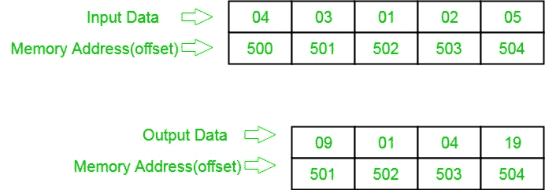

# 8086 确定 n 个数字数组中数字平方的程序

> 原文: [https://www.geeksforgeeks.org/8086-program-to-determine-squares-of-numbers-in-an-array-of-n-numbers/](https://www.geeksforgeeks.org/8086-program-to-determine-squares-of-numbers-in-an-array-of-n-numbers/)

## 问题
在 8086 微处理器中编写一个程序，找出 8 位 n 个数的平方，其中大小 `n` 存储在偏移量 `500` 处，个数从偏移量 `501` 开始存储，并将结果数存储到偏移量 `501` 中。(假设正方形的长度只有 8 位)。

## 示例

## 算法
1.  将 `500` 存储到 `SI`，并将偏移量 `500` 的数据加载到寄存器 `CL`，并将寄存器 `CH` 设置为 `00`(用于计数)。
2.  将 `SI` 值增加 1。
3.  从下一个偏移量(即 `501`)加载第一个数字(值)到寄存器 `AL`。
4.  将寄存器 `AL` 中的值乘以自身。
5.  将结果(寄存器 `AL` 的值)存储到存储器偏移 `SI`。
6.  将 `SI` 值增加 1。
7.  循环以上步骤，直到 `CX` 寄存器得到 0。

## 程序
| 存储地址 | 记忆术 | 评论 |
| --- | --- | --- |
| `400` | `MOV SI, 500` | `SI` 指向 `500` |
| `403` | `MOV CL, [SI]` | `CL` 获取计数 |
| `405` | `MOV CH, 00` | `CH` 清零 |
| `407` | `INC SI` | `SI` 指向数据 |
| `408` | `MOV AL, [SI]` | `AL` 获取数据 |
| `40A` | `MUL AL` | `AX = AL * AL` |
| `40C` | `MOV [SI], AL` | `AL` -> `[SI]` |
| `40E` | `INC SI` | `SI` 指向下一位置 |
| `40F` | `LOOP 408` | 跳转到 `408` 如果 `CX != 0`，`CX = CX - 1` |
| `411` | `HLT` | 结束 |

## 解释
1.  `MOV SI, 500`: 将 `SI` 的值设置为 `500`。
2.  `MOV CL, [SI]`: 从偏移 `SI` 向寄存器 `CL` 加载数据。
3.  `MOV CH, 00`: 将寄存器 `CH` 的值设置为 `00`。
4.  `INC SI`: `SI` 值增加 1。
5.  `MOV AL, [SI]`: 从偏移 `SI` 到寄存器 `AL` 的加载值。
6.  `MUL AL`: 寄存器 `AL` 的值乘以 `AL`。
7.  `MOV [SI], AL`: 存储偏移量 `SI` 处寄存器 `AL` 的值。
8.  `INC SI`: `SI` 值增加 1。
9.  `LOOP 408`: 如果 `CX` 不是 0，`CX = CX - 1`，跳转到地址 `408`。
10. `HLT`: 停止。