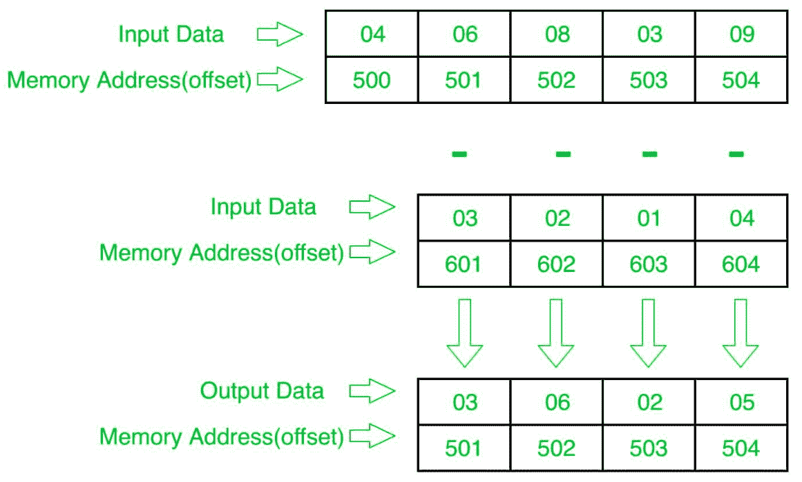

# 8086 程序确定两个数组对应元素的减法

> 原文：[https://www.geeksforgeeks.org/8086-program-to-determine-subtraction-of-corresponding-elements-of-two-arrays/](https://www.geeksforgeeks.org/8086-program-to-determine-subtraction-of-corresponding-elements-of-two-arrays/)

## 问题
在 8086 微处理器中编写程序，找出两个 8 位 `n` 个数数组对应元素的减法，其中大小 `n` 存储在偏移量 `500` 处，第一个数组的个数从偏移量 `501` 开始存储，第二个数组的个数从偏移量 `601` 开始存储，将结果个数存储到第一个数组即偏移量 `501` 中。

## 示例

## 算法
1.  将 `500` 存储到 `SI`，将 `601` 存储到 `DI`，并将来自偏移量 `500` 的数据加载到寄存器 `CL`，并将寄存器 `CH` 设置为 `00`（用于计数）。
2.  将 `SI` 值增加 `1`。
3.  从下一个偏移量（即 `501`）加载第一个数字（值）到寄存器 `AL`。
4.  用偏移量 `DI` 处的值减去寄存器 `AL` 中的值。
5.  将结果（寄存器 `AL` 的值）存储到存储器偏移 `SI`。
6.  将 `SI` 值增加 `1`。
7.  将 `DI` 的值增加 `1`。
8.  循环 `5` 次以上，直到 `CX` 寄存器为 `0`。

## 程序
| 存储地址 | 记忆术 | 评论 |
| --- | --- | --- |
| `400` | `MOV SI, 500` | `SI <- 500` |
| `403` | `MOV CL, [SI]` | `CL <- [SI]` |
| `405` | `MOV CH, 00` | `CH <- 00` |
| `407` | `INC SI` | `SI <- SI + 1` |
| `408` | `MOV DI, 601` | `DI <- 601` |
| `40B` | `MOV AL, [SI]` | `AL <- [SI]` |
| `40D` | `SUB AL, [DI]` | `AL = AL - [DI]` |
| `40F` | `MOV [SI], AL` | `[SI] <- AL` |
| `411` | `INC SI` | `SI <- SI + 1` |
| `412` | `INC DI` | `DI <- DI + 1` |
| `413` | `LOOP 40B` | 如果 `CX != 0`，跳转到 `40B`，`CX = CX - 1` |
| `415` | `HLT` | 结束 |

## 解释
1.  `MOV SI, 500`：将 `SI` 的值设置为 `500`。
2.  `MOV CL, [SI]`：从偏移 `SI` 向寄存器 `CL` 加载数据。
3.  `MOV CH, 00`：将寄存器 `CH` 的值设置为 `00`。
4.  `INC SI`：`SI` 值增加 `1`。
5.  `MOV DI, 601`：将 `DI` 的值设置为 `601`。
6.  `MOV AL, [SI]`：从偏移 `SI` 到寄存器 `AL` 的加载值。
7.  `SUB AL, [DI]`：用偏移量 `DI` 处的内容减去寄存器 `AL` 的值。
8.  `MOV [SI], AL`：存储偏移量 `SI` 处寄存器 `AL` 的值。
9.  `INC SI`：`SI` 值增加 `1`。
10. `INC DI`：`DI` 值增加 `1`。
11. `LOOP 40B`：如果 `CX` 不是 `0`，`CX = CX - 1`，跳转到地址 `40B`。
12. `HLT`：停止。