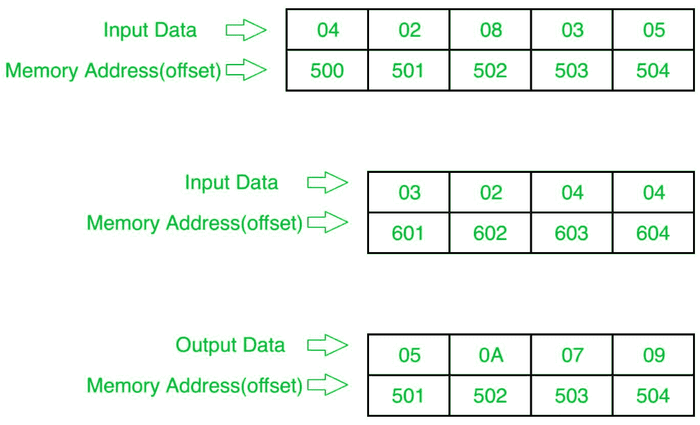

# 8086 程序确定两个数组对应元素的和

> 原文:[https://www.geeksforgeeks.org/8086-program-to-determine-sum-of-corresponding-elements-of-two-arrays/](https://www.geeksforgeeks.org/8086-program-to-determine-sum-of-corresponding-elements-of-two-arrays/)

## 问题
在 8086 微处理器中编写一个程序，找出两个 8 位 n 个数数组的和，其中大小“n”存储在偏移量 `500` 处，第一个数组的个数从偏移量 `501` 开始存储，第二个数组的个数从偏移量 `601` 开始存储，并将结果个数存储到第一个数组即偏移量 `501` 中。

## 示例


## 算法
1.  将 `500` 存储到 `SI`，将 `601` 存储到 `DI`，并将来自偏移量 `500` 的数据加载到寄存器 `CL`，并将寄存器 `CH` 设置为 `00`(用于计数)。
2.  将 `SI` 值增加 `1`。
3.  从下一个偏移量(即 `501`)加载第一个数字(值)到寄存器 `AL`。
4.  将寄存器 `AL` 中的值与偏移量 `DI` 处的值相加。
5.  将结果(寄存器 `AL` 的值)存储到存储器偏移 `SI`。
6.  将 `SI` 值增加 `1`。
7.  将 `DI` 的值增加 `1`。
8.  循环 `5` 次以上，直到 `CX` 寄存器为 `0`。

## 程序
```
400: MOV SI, 500      ; SI
403: MOV CL, [SI]     ; CL
405: MOV CH, 00       ; CH
407: INC SI           ; SI
408: MOV DI, 601      ; DI
40B: MOV AL, [SI]     ; AL
40D: ADD AL, [DI]     ; AL = AL+[DI]
40F: MOV [SI], AL     ; AL >[SI]
411: INC SI           ; SI
412: INC DI           ; DI
413: LOOP 40B         ; 如果 CX!=0，跳到 40B，CX=CX-1
415: HLT              ; 结束
```

## 解释
1.  `MOV SI, 500`: 将 `SI` 的值设置为 `500`
2.  `MOV CL, [SI]`: 从偏移 `SI` 向寄存器 `CL` 加载数据
3.  `MOV CH, 00`: 将寄存器 `CH` 的值设置为 `00`
4.  `INC SI`: `SI` 值增加 `1`。
5.  `MOV DI, 600`: 将 `DI` 的值设置为 `600`。
6.  `MOV AL, [SI]`: 从偏移 `SI` 到寄存器 `AL` 的加载值
7.  `ADD AL, [DI]`: 通过偏移量 `DI` 处的内容添加寄存器 `AL` 的值。
8.  `MOV [SI], AL`: 存储偏移量 `SI` 处寄存器 `AL` 的值。
9.  `INC SI`: `SI` 值增加 `1`。
10. `INC DI`: `DI` 值增加 `1`。
11. `LOOP 408`: 如果 `CX` 不是 `0`，`CX=CX-1`，跳转到地址 `408`。
12. `HLT`: 停止