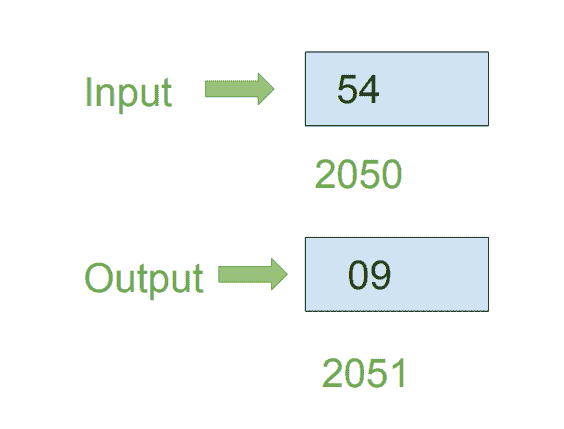

# 8086 程序求 8 位数字之和

> 原文：[https://www.geeksforgeeks.org/8086-program-to-find-sum-of-digits-of-8-bit-number/](https://www.geeksforgeeks.org/8086-program-to-find-sum-of-digits-of-8-bit-number/)

## 问题
在 8086 微处理器中编写汇编语言程序，用 8 位运算求 8 位数字的位数和。

## 示例
假设 8 位数字存储在存储器位置 `2050`。

## 假设
输入数据和输出数据的地址分别为 `2050` 和 `2051`。

## 算法
1.  加载寄存器 `AL` 中存储单元 `2050` 的内容。
2.  将寄存器 `AL` 的内容复制到寄存器 `AH`。
3.  将 `0004` 分配给 `CX` 寄存器对。
4.  用 `0F` 对 `AL` 的内容进行与运算，并将结果存储在 `AL` 中。
5.  通过使用 `CX` 执行 `ROL` 指令来旋转 `AH` 的内容。
6.  用 `0F` 对 `AH` 的内容进行“与”运算，并将结果存储在 `AH` 中。
7.  添加 `AL` 和 `AH` 内容，并将结果存储在 `AL` 中。
8.  将 `AL` 的内容存储在内存位置 `2051`。

## 程序

| 存储地址 | 记忆术 | 评论 |
| :--- | :--- | :--- |
| `400` | `MOV AL, [2050]` | `AL` <- `[2050]` |
| `404` | `MOV AH, AL` | `AH` <- `AL` |
| `406` | `MOV CX, 0004` | `CX` <- `0004` |
| `409` | `AND AL, 0F` | `AL` <- `AL` AND `0F` |
| `40B` | `ROL AH, CX` | 将 `AH` 内容向左旋转 4 位（`CX` 值） |
| `40D` | `AND AH, 0F` | `AH` <- `AH` AND `0F` |
| `40F` | `ADD AL, AH` | `AL` <- `AL` + `AH` |
| `411` | `MOV [2051], AL` | `[2051]` <- `AL` |
| `415` | `HLT` | 停止执行 |

## 解释
1.  `MOV AL, [2050]`：加载 `AL` 中的存储单元 `2050` 的内容。
2.  `MOV AH, AL`：将寄存器 `AL` 的内容复制到寄存器 `AH`。
3.  `MOV CX, 0004`：将 `0004` 分配给 `CX` 寄存器对。
4.  `AND AL, 0F`：用 `0F` 对 `AL` 的含量进行 `AND` 运算，并将结果存储在 `AL` 中。
5.  `ROL AH, CX`：将 `AH` 寄存器的内容向左旋转 4 位，即 `CX` 寄存器对的值。
6.  `AND AH, 0F`：用 `0F` 对 `AH` 的内容进行 `AND` 运算，并将结果存储在 `AH` 中。
7.  `ADD AL, AH`：添加 `AL` 和 `AH` 含量，并将结果存储在 `AL` 中。
8.  `MOV [2051], AL`：将 `AL` 的内容存储在 `2051` 内存地址中。
9.  `HLT`：停止执行程序。