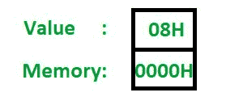
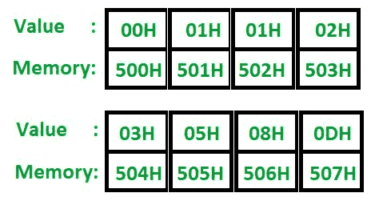
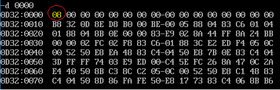
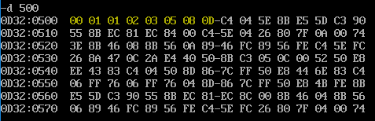

# 8086 程序生成斐波那契数列

> 原文: [https://www.geeksforgeeks.org/8086-program-to-generate-fibonacci-sequence/](https://www.geeksforgeeks.org/8086-program-to-generate-fibonacci-sequence/)

## 问题

编写一个 8086 汇编级程序，生成斐波那契数列。序列的长度存储在偏移值为 0 的数据段中。我们将从偏移量 `500` 开始，将生成的序列存储在数据段中。

**注:** 生成的数字和内存位置以十六进制格式表示。

## 例

**输入:**



**输出:**



## 算法

斐波那契数列是通过将第 `i` 个元素和第 `i-1` 个元素相加，并将其存储到第 `i+1` 个位置而生成的。考虑到第一和第二个位置分别用 `0` 和 `1` 初始化，这是成立的。使用汇编级指令执行过程需要遵循以下步骤。

1.  将偏移量 `00H` 处存储的值移入 `CX` (这将充当计数器)，并将其减 2 (因为我们需要显式加载序列的前 2 个元素)
2.  将 `00H` 移入 `AL`
3.  将 `500H` 移入 `SI`
4.  将 `AL` 移入 `[SI]`
5.  将 `AL` 和 `SI` 都增加 1，并将 `AL` 的值存储在 `[SI]` 中 (这样，我们已经将序列的前 2 个元素加载到内存中)
6.  将第 `[SI-1]` 个值移入 `AL`
7.  将第 `[SI]` 个值移入 `AH`
8.  将 `00H` 移入 `BH`
9.  添加 `BH` 和 `AH` (结果存储在 `BH` 中)
10. 用 `AL` 再次添加 `BH`
11. 将 `SI` 增加 1
12. 将 `BH` 存储到 `[SI]` 中
13. 循环回到步骤 6，直到计数器变为 0
14. 停止

## 程序

```
存储地址   指令/助记符      解释/评论
2000       MOV AL, 00H     AL = 00H
2002       MOV SI, 500H    SI = 500H
2005       MOV [SI], AL    [SI] = AL
2007       ADD SI, 01H     SI = SI + 1
200A       ADD AL, 01H     AL = AL + 1
200C       MOV [SI], AL    [SI] = AL
200E       MOV CX, [0000H] CX = [0000H]
2012       SUB CX, 0002H   CX = CX - 2
2015   L1: MOV AL, [SI-1]  AL = [SI-1]
2018       ADD AL, [SI]    AL = AL + [SI]
201A       ADD SI, 01H     SI = SI + 1
201D       MOV [SI], AL    [SI] = AL
201F       LOOP L1         跳转到 L1，直到 CX=0
2021       HLT             停止
```

## 说明

1.  **MOV AL, 00H:** `AL` 现在具有序列中的第一个数字
2.  **MOV SI, 500H:** 使 `SI` 指向输出位置
3.  **MOV [SI], AL:** 移动 `0` 到第一位置
4.  **ADD SI, 1:** 增加 `SI` 指向下一个内存位置
5.  **ADD AL, 1:** 现在，`AL` 具有序列的第二个元素
6.  **MOV [SI], AL:** 移动 `01H` 到第二位置
7.  **MOV CX, [0000H]:** 将偏移量 `0` 处存储的值移入 `CX` (计数器)
8.  **SUB CX, 02H:** 由于我们已经初始化了序列的前 2 个元素，我们需要将计数器减 2
9.  **L1:** 这定义了循环的开始 (创建了一个标签)
10. **MOV AL, [SI-1]:** 将第 `(i-1)` 个位置的元素移动到 `AL`
11. **ADD AL, [SI]:** 将 `AL` 中已经存在的第 `(i-1)` 个元素与第 `i` 个元素相加
12. **ADD SI, 1:** 增加 `SI` 指向下一个位置
13. **MOV [SI], AL:** 将总和存储在新位置
14. **LOOP L1:** 标签 `L1` 和该 `LOOP` 指令之间的指令执行 `CX` 次
15. **HLT:** 结束程序

## 实际输出

带圆圈的内存位置 (`0000`) 包含序列的长度。对于这个程序，它是 `8`。



突出显示的值是斐波那契数列的元素 (以十六进制表示)。因此，`13` 表示为 `0D`。



参考: [8085 程序生成斐波那契数列](https://www.geeksforgeeks.org/?p=201540)

享受编码！