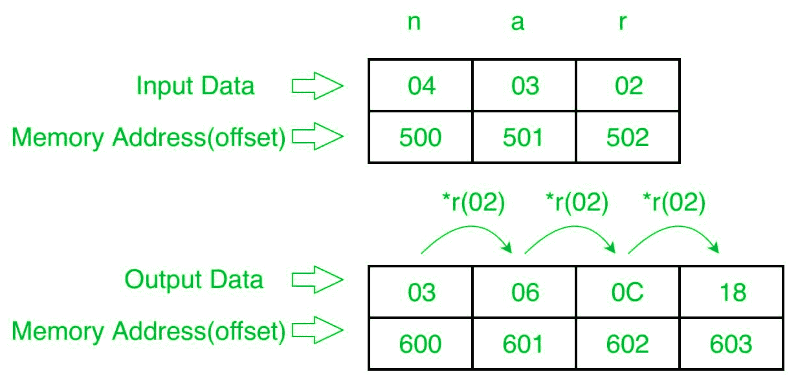

# 8086 程序生成 n 个数的 G.P 系列

> 原文: [https://www.geeksforgeeks.org/8086-program-to-generate-g-p-series-of-n-numbers/](https://www.geeksforgeeks.org/8086-program-to-generate-g-p-series-of-n-numbers/)

## 问题
在 8086 微处理器中编写一个程序，生成 n 个数字的 G.P（几何级数）序列（数字只有 8 位），其中大小“n”存储在偏移量 `500` 处，第一个数字（a）存储在偏移量 `501` 处，存储公共比率存储在偏移量 `502` 处。将系列存储到偏移 `600`。

## 示例


## 算法
1.  将 `500` 存储到 `SI`，将 `600` 存储到 `DI`。将偏移量 `500` 的数据加载到寄存器 `CL`，并将寄存器 `CH` 设置为 `00`（用于计数）。
2.  将 `SI` 值增加 `1`。
3.  从下一个偏移量（即 `501`）加载第一个数字（值）到寄存器 `AL`。
4.  将寄存器 `AL` 的值存储到内存偏移 `DI`。
5.  将 `DI` 增加 `1`。
6.  将 `CL` 减少 `1`。
7.  从下一个偏移量（即 `502`）加载第二个数字（公共比率）到寄存器 `BL`。
8.  将寄存器 `AL` 和 `BL` 相乘。
9.  将结果（寄存器 `AL` 的值）存储到内存偏移 `DI`。
10. 将 `SI` 值增加 `1`。
11. 循环步骤 3 以上，直到 `CX` 寄存器得到 `0`。

## 程序
| 存储地址 | 记忆术 | 评论 |
| --- | --- | --- |
| `400` | `MOV SI, 500` | `SI` |
| `403` | `MOV CL, [SI]` | `CL` |
| `405` | `MOV CH, 00` | `CH` |
| `407` | `INC SI` | `SI` |
| `408` | `MOV AL, [SI]` | `AL` |
| `40A` | `INC SI` | `SI` |
| `40B` | `MOV DI, 600` | `DI` |
| `40E` | `MOV [DI], AL` | `[DI]` |
| `410` | `INC DI` | `DI` |
| `411` | `DEC CL` | `CL` |
| `412` | `MOV BL, [SI]` | `BL` |
| `414` | `MUL BL` | `AX` |
| `416` | `MOV [DI], AL` | `[DI]` |
| `418` | `INC DI` | `DI` |
| `419` | `LOOP 414` | 跳到 `414` 如果 `CX != 0`，`CX=CX-1` |
| `41B` | `HLT` | 结束 |

## 解释
```
MOV SI, 500    ; 将 SI 的值设置为 500。
MOV CL, [SI]   ; 从偏移 SI 向寄存器 CL 加载数据。
MOV CH, 00     ; 将寄存器 CH 的值设置为 00。
INC SI         ; SI 值增加 1。
MOV AL, [SI]   ; 从偏移 SI 加载值到寄存器 AL。
INC SI         ; SI 值增加 1。
MOV DI, 600    ; 将 DI 的值设置为 600。
MOV [DI], AL   ; 在偏移 DI 存储寄存器 AL 的值。
INC DI         ; DI 值增加 1。
DEC CL         ; 将寄存器 CL 的值减少 1。
MOV BL, [SI]   ; 从偏移 SI 加载值到寄存器 BL。
MUL BL         ; 寄存器 AL 的值乘以 BL。
MOV [DI], AL   ; 在偏移 DI 存储寄存器 AL 的值。
INC DI         ; DI 值增加 1。
LOOP 414       ; 如果 CX 不是 0，CX=CX-1，跳转到地址 414。
HLT            ; 停止。
```