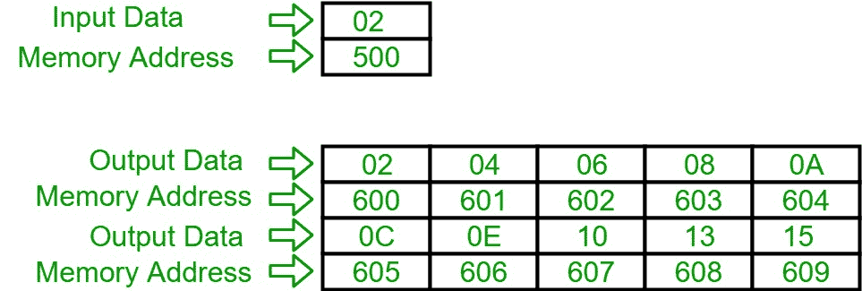

# 8086 程序打印输入整数的表格

> 原文：[https://www.geeksforgeeks.org/8086-program-to-print-the-table-of-input-integer/](https://www.geeksforgeeks.org/8086-program-to-print-the-table-of-input-integer/)

## 问题
用 8086 编写汇编语言程序，打印输入整数的表格。

## 假设
假设输入的数字在内存位置 `500`，表格将以十六进制从起始位置 `600` 打印到 `609`。

## 示例


## 算法
1.  在 `SI` 中加载输入数字地址，并且在 `DI` 中加载我们想要输出的地址。
2.  在 `CH` 寄存器中存储 `00`。
3.  将 `CH` 的值增加 1，并将 `[SI]` 的内容移入 `AH` 寄存器。
4.  将 `AL` 和 `CH` 的内容相乘并存储在 `AX` 中，然后将 `AL` 的内容移入 `[DI]`，然后将 `DI` 的值增加 1。
5.  比较 `CH` 和 `0A` 的值，如果不相等，则进入步骤 3，否则暂停程序。

## 程序
```
地址      记忆术          评论
400       MOV SI, 500     SI
403       MOV DI, 600     DI
406       MOV CH, 00      CH
408       INC CH          CH
409       MOV AL, [SI]    AL
40B       MUL CH          AX
40D       MOV [DI], AL    [DI]
40F       INC DI          DI
410       CMP CH, 0A      CH-0A
413       JNZ 408         如果零标志为 0，跳转到地址 408
415       HLT             终止程序
```

## 解释
1.  `MOV SI, 500`：将 `500` 装入 `SI`。
2.  `MOV DI, 600`：将 `600` 装入 `DI`。
3.  `MOV CH, 00`：在 `CH` 寄存器中加载 `00` 数据。
4.  `INC CH`：将 `CH` 寄存器内的值增加 1。
5.  `MOV AL, [SI]`：将 `[SI]` 的内容移入 `AL` 寄存器。
6.  `MUL CH`：将 `AL` 和 `CH` 寄存器的内容相乘，存入 `AX` 寄存器。
7.  `MOV [DI], AL`：将 `AL` 寄存器的内容移入 `[DI]`。
8.  `INC DI`：将 `DI` 的值增加 1。
9.  `CMP CH, 0A`：比较 `CH` 寄存器和 `0A` 的数据。
10. `JNZ 408`：如果零标志为 0，跳转到地址 `408`。
11. `HLT`：终止程序。