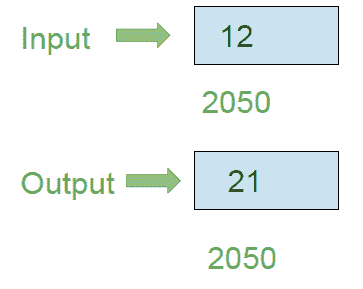

# 8086程序使用8位操作反转8位数字

> 原文：[https://www.geeksforgeeks.org/8086-program-to-reverse-8-bit-number-using-8-bit-operation/](https://www.geeksforgeeks.org/8086-program-to-reverse-8-bit-number-using-8-bit-operation/)

## 问题
在8086微处理器中编写汇编语言程序，使用8位操作反转8位数字。

## 示例
假设8位数字存储在存储器位置`2050`。

## 算法
1.  加载寄存器`AL`中存储单元`2050`的内容。
2.  将`0004`分配给`CX`寄存器对。
3.  通过使用`CX`执行`ROL`指令来旋转`AL`的内容。
4.  将`AL`的内容存储在存储单元`2050`中。

## 程序

| 存储地址 | 记忆术 | 评论 |
| --- | --- | --- |
| `400` | `MOV AL, [2050]` | `AL` |
| `404` | `MOV CX, 0004` | `CX` |
| `407` | `ROL AL, CL` | 将`AL`内容向左旋转4位（`CX`值） |
| `409` | `MOV [2050], AL` | `[2050]` |
| `40D` | `HLT` | 停止执行 |

## 解释
1.  `MOV AL, [2050]` 加载`AL`中存储单元`2050`的内容。
2.  `MOV CX, 0004` 将`0004`分配给`CX`寄存器对。
3.  `ROL AL, CL` 将`AL`寄存器的内容向左旋转4位，即`CX`寄存器对的值。
4.  `MOV [2050], AL` 将`AL`的内容存储在`2050`内存地址中。
5.  `HLT` 停止执行程序。