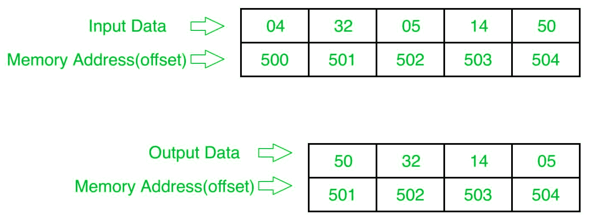

# 8086 程序对整数数组进行降序排序

> 原文：[https://www.geeksforgeeks.org/8086-program-to-sort-an-integer-array-in-descending-order/](https://www.geeksforgeeks.org/8086-program-to-sort-an-integer-array-in-descending-order/)

## 问题
在 8086 微处理器中编写一个程序，对 `n` 个数字的数组中的数字进行降序排序，其中大小 `n` 存储在内存地址 `2000:500`，数字从内存地址 `2000:501` 开始存储。

## 示例



示例说明：

```
初始数组: 32 05 14 50
通行证-1: 32 05 14 50 -> 32 05 14 50 -> 32 14 05 50 -> 32 14 50 05 (1 个号码搞定)
通行证-2: 32 14 50 05 -> 32 14 50 05 -> 32 50 14 05 (2 个号码已确定)
传球-3: 32 50 14 05 -> 50 32 14 05 (已排序)
```

## 算法
1.  将数据从偏移量 `500` 加载到寄存器 `CL` (用于计数)。
2.  从起始内存位置移动到最后，如果第一个数字小于第二个数字，比较两个数字，然后交换它们。
3.  第一遍确定最后一个数字的位置。
4.  将计数减少 `1`。
5.  再次从起始存储位置移动到 (倒数第一，借助计数) 并比较两个数字，如果第一个数字小于第二个数字，则交换它们。
6.  第二遍确定最后两个数字的位置。
7.  重复。

## 程序

| 存储地址 | 记忆术 | 评论 |
| --- | --- | --- |
| `400` | `MOV SI, 500` | `SI` |
| `403` | `MOV CL, [SI]` | `CL` |
| `405` | `DEC CL` | `CL` |
| `407` | `MOV SI, 500` | `SI` |
| `40A` | `MOV CH, [SI]` | `CH` |
| `40C` | `DEC CH` | `CH` |
| `40E` | `INC SI` | `SI` |
| `40F` | `MOV AL, [SI]` | `AL` |
| `411` | `INC SI` | `SI` |
| `412` | `CMP AL, [SI]` | `[SI]` |
| `414` | `JNC 41C` | 跳到 `41C` 如果 `!=1` |
| `416` | `XCHG AL, [SI]` | 互换 `AL` 和 `SI` |
| `418` | `DEC SI` | `SI` |
| `419` | `XCHG AL, [SI]` | 互换 `AL` 和 `SI` |
| `41B` | `INC SI` | `SI` |
| `41C` | `DEC CH` | `CH` |
| `41E` | `JNZ 40F` | 如果 `ZF=0`，跳到 `40F` |
| `420` | `DEC CL` | `CL` |
| `422` | `JNZ 407` | 如果 `ZF=0`，跳到 `407` |
| `424` | `HLT` | 结束 |

## 解释
1.  `MOV SI, 500`：将 `SI` 的值设置为 `500`。
2.  `MOV CL, [SI]`：从偏移 `SI` 向寄存器 `CL` 加载数据。
3.  `DEC CL`：寄存器 `CL` 的值减 `1`。
4.  `MOV SI, 500`：将 `SI` 的值设置为 `500`。
5.  `MOV CH, [SI]`：从偏移 `CH` 向寄存器 `CH` 加载数据。
6.  `DEC CH`：寄存器 `CH` 的值减少 `1`。
7.  `INC SI`：`SI` 值增加 `1`。
8.  `MOV AL, [SI]`：从偏移 `SI` 到寄存器 `AL` 的加载值。
9.  `INC SI`：`SI` 值增加 `1`。
10. `CMP AL, [SI]`：比较寄存器 `AL` 和 `[SI]` 的值 (`AL-[SI]`)。
11. `JNC 41C`：未生成进位跳转到地址 `41C`。
12. `XCHG AL, [SI]`：交换寄存器 `AL` 和 `SI` 的内容。
13. `DEC SI`：`SI` 值减 `1`。
14. `XCHG AL, [SI]`：交换寄存器 `AL` 和 `SI` 的内容。
15. `INC SI`：`SI` 值增加 `1`。
16. `DEC CH`：寄存器 `CH` 的值减 `1`。
17. `JNZ 40F`：如果零平复位，跳转到地址 `40F`。
18. `DEC CL`：寄存器 `CL` 的值减 `1`。
19. `JNZ 407`：如果零平复位，跳转到地址 `407`。
20. `HLT`：停止。