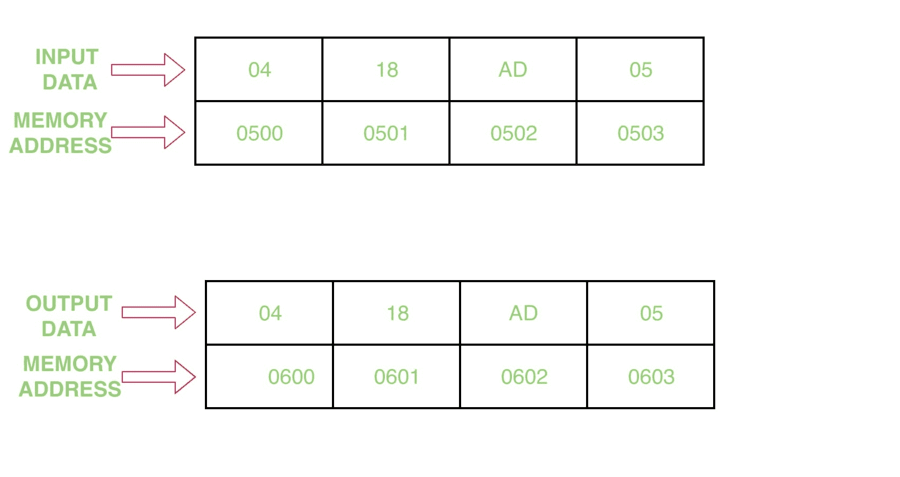

# 8086 程序使用字符串指令传输一个 4 字节的块

> 原文:[https://www.geeksforgeeks.org/8086-program-transfer-block-4-bytes-using-string-instructions/](https://www.geeksforgeeks.org/8086-program-transfer-block-4-bytes-using-string-instructions/)

## 问题
编写一个程序，传输一个 4 字节的块，起始地址为 `0500`，使用字符串指令传输地址为 `0600` 的块。

## 示例

## 假设
假设内存地址 `0500`、`0501`、`0502`、`0503` 中有 4 个块。

## 算法
1.  在 `SI` 中赋值 `500`，在 `DI` 中赋值 `600`
2.  将值 `0000` 分配给 `AX`
3.  在 `DS` 中移动 `AX` 的内容
4.  在 `ES` 中移动 `AX` 的内容
5.  将值 `0004H` 分配给 `CX`
6.  清除方向标志
7.  重复直到 `CX=0`，移动字符串块
8.  程序暂停

## 程序
| 存储地址 | 记忆术 | 评论 |
| --- | --- | --- |
| `0400` | `MOV SI, 500` | `SI` |
| `0403` | `MOV DI, 600` | `DI` |
| `0406` | `MOV AX, 0000` | `AX` |
| `0409` | `MOV DS, AX` | `DS` |
| `040B` | `MOV ES, AX` | `ES` |
| `040D` | `MOV CX, 0004` | `CX` |
| `0410` | `CLD` | 清除方向标志 |
| `0411` | `REP` | 重复直到 `CX=0` |
| `0412` | `MOVSB` | 移动区块 |
| `0413` | `HLT` | 程序结束 |

## 解释
1.  `MOV SI, 500` 指定 `500` 给 `SI`
2.  `MOV DI, 600` 分配 `600` 给 `DI`
3.  `MOV AX, 0000` 将 `0000` 分配给 `AX` 寄存器
4.  `MOV DS, AX` 将 `AX` 的内容移动到 `DS` 段
5.  `MOV ES, AX` 将 `AX` 的内容移动到 `ES` 段
6.  `MOV CX, 0004` 将 `0004` 分配给 `CX` 寄存器
7.  `CLD` 清除了方向标志
8.  `REP` 重复，直到 `CX=0`
9.  `MOVSB` 移动字符串块
10. `HLT` 停止程序的执行。