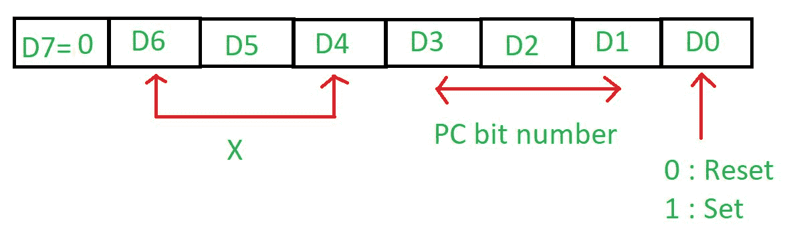
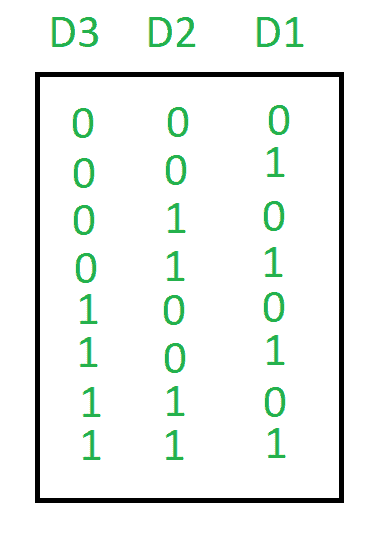
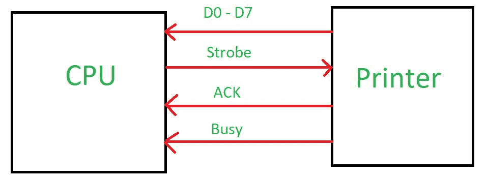
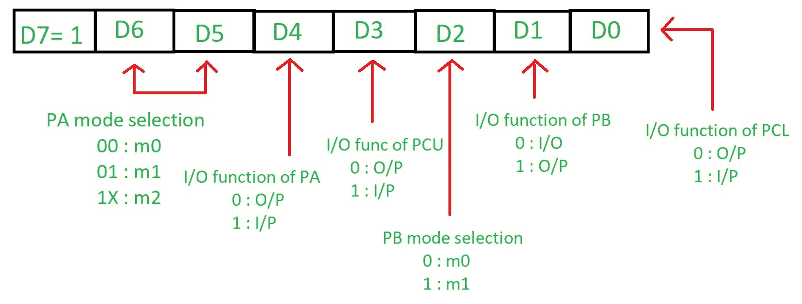
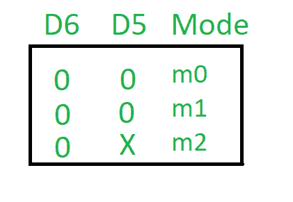

# 8255 微处理器操作模式

> 原文: [https://www.geeksforgeeks.org/8255-microprocessor-operating-modes/](https://www.geeksforgeeks.org/8255-microprocessor-operating-modes/)

8255 微处理器有两种模式:

## 1. 位设置复位 (BSR) 模式

该模式仅用于设置或复位端口 C 的位，当控制寄存器的最高有效位 (`D7`) 为 0 时选择。控制寄存器如下:

这种模式一次只影响端口 C 的一个位，因为当用户设置该位时，它会一直保持设置，直到用户更改它。用户需要载入控制寄存器中的位模式来改变位。

## 2. 输入/输出模式 (I/O 模式)

当控制寄存器的最高有效位 (`D7`) 为 1 时，选择该模式。

### 模式 0 – 简单或基本输入/输出模式

端口 A、B 和 C 可以作为输入功能或输出功能。输出被锁存，但输入未被锁存。它具有中断处理能力。

### 模式 1 – 握手或选通输入/输出

在此模式下，端口 A 或 B 可以工作，端口 C 的位用于提供握手信号。输出和输入都被锁存。它具有中断处理能力。在实际数据传输之前，会传输信号以匹配 CPU 和打印机的速度。

**例:** 当 CPU 想向打印机这样速度较慢的外设发送数据时，会向打印机发送握手信号，告知是否准备好传输数据。当打印机准备就绪时，它将向中央处理器发送一个确认，然后通过数据总线传输数据。

### 模式 2 – 双向输入/输出

在此模式下，只有端口 A 会工作，端口 B 可以处于模式 0 或 1，端口 C 的位用作握手信号。输出和输入都被锁存。它具有中断处理能力。控制寄存器如下:

输入/输出模式的最高有效位 (`D7`) 为 1，BSR 模式为 0。

`D6` 和 `D5` 用于设置端口 A 的模式。

`D4` 用于判断端口 A 是在进行输入还是在显示结果。如果为 1，则它接受输入，否则显示输出。
`D3` 用于判断端口 C 高位是取输入还是显示结果。如果为 1，则它接受输入，否则显示输出。
`D2` 告知端口 B 的模式，如果为 0，则端口 B 处于 `m0` 模式，否则处于 `m1` 模式。
`D1` 用于判断端口 B 是在取输入还是在显示结果。如果为 1，则它接受输入，否则显示输出。
`D0` 用于判断端口 C 低位是取输入还是显示结果。如果为 1，则它接受输入，否则显示输出。

当 8255 微处理器复位时，它将清除控制字寄存器内容，将所有端口设置为输入模式。