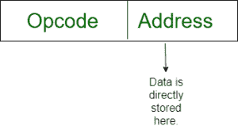
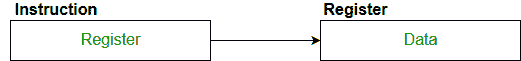
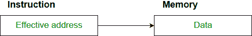

# 寻址模式

> 原文:[https://www.geeksforgeeks.org/addressing-modes/](https://www.geeksforgeeks.org/addressing-modes/)

**寻址模式**–术语寻址模式是指指定指令操作数的方式。寻址模式指定了在实际执行操作数之前解释或修改指令地址字段的规则。

## 8086 指令的寻址方式

8086 指令的寻址方式分为两类:
1. 数据寻址模式
2. 分支寻址模式

8086 内存寻址模式提供灵活的内存访问，允许您轻松访问变量、数组、记录、指针和其他复杂的数据类型。好的汇编语言编程的关键是正确使用内存寻址模式。

汇编语言程序指令由两部分组成:
[](https://media.geeksforgeeks.org/wp-content/cdn-uploads/Addressing_Modes_1.jpg)

操作数的内存地址由两部分组成:

## 重要条款

*   **内存段的起始地址**。
*   **有效地址或偏移量**:偏移量通过添加三个地址元素的任意组合来确定:**位移、基数和索引。**
    *   **位移:**是指令中给出的 8 位或 16 位立即值。
    *   **基础**:基础寄存器的内容，`BX` 或 `BP`。
    *   **索引**:索引寄存器 `SI` 或 `DI` 的内容。

根据 8086 微处理器指定操作数的不同方式，8086 采用不同的寻址方式。

## 8086 微处理器使用的寻址模式

8086 微处理器使用的**寻址模式**讨论如下:

### 隐含模式
在隐含寻址中，操作数是在指令本身中指定的。在这种模式下，数据长度为 8 位或 16 位，数据是指令的一部分。零地址指令采用隐含寻址方式设计。
[](https://media.geeksforgeeks.org/wp-content/cdn-uploads/Addressing_Modes_2.jpg)

```
Example: CLC (used to reset Carry flag to 0)
```

### 立即寻址模式
在该模式下，数据出现在指令的地址字段中。设计成一种地址指令格式。
**注意:**立即模式的限制是常量的范围受地址字段大小的限制。


```
Example: MOV AL, 35H (move the data 35H into AL register)
```

### 寄存器模式
在寄存器寻址中，操作数被放置在 8 位或 16 位通用寄存器之一中。数据在指令指定的寄存器中。
*这里需要一个寄存器引用来访问数据。*
[](https://media.geeksforgeeks.org/wp-content/cdn-uploads/Addressing_Modes_3.jpg)

```
Example: MOV AX,CX (move the contents of CX register to AX register)
```

### 寄存器间接模式
在这个寻址中，操作数的偏移量被放置在指令中指定的寄存器 `BX`、`BP`、`SI`、`DI` 中的任何一个中。数据的有效地址在指令指定的基址寄存器或索引寄存器中。
*这里需要两个寄存器引用才能访问数据。*
[](https://media.geeksforgeeks.org/wp-content/cdn-uploads/Addressing_Modes_4.jpg)
8086 CPU 通过寄存器间接寻址模式，让你通过寄存器间接访问内存。

```
MOV AX, [BX] (move the contents of memory location addressed by the register BX to the register AX)
```

### 自动索引（增量模式）
操作数的有效地址是指令中指定的寄存器的内容。访问操作数后，该寄存器的内容会自动递增，以指向下一个连续的内存位置。**(R1)+**。
*这里需要一个寄存器引用、一个内存引用和一个 ALU 操作来访问数据。*
示例:

```
Add R1, (R2)+  // OR
R1 = R1 + M[R2]
R2 = R2 + d
```

*用于循环遍历数组。`R2`–数组的开始 `d`–元素的大小*

### 自动索引（减量模式）
操作数的有效地址是指令中指定的寄存器的内容。在访问操作数之前，该寄存器的内容会自动递减，以指向前一个连续的内存位置。*–**(R1)**。
*这里需要一个寄存器引用、一个内存引用和一个 ALU 操作来访问数据。*

**示例:**

```
Add R1,-(R2)   //OR
R2 = R2 - d
R1 = R1 + M[R2]
```

*自动减量模式与自动增量模式相同。两者都可以用来实现一个堆栈，如 push 和 pop。自动递增和自动递减模式对于实现“后进先出”数据结构非常有用。*

### 直接寻址/绝对寻址模式
操作数的偏移量在指令中作为一个 8 位或 16 位的位移元素给出。在这种寻址模式中，数据的 16 位有效地址是指令的一部分。
*这里只需要一次内存引用操作来访问数据。*

[](https://media.geeksforgeeks.org/wp-content/cdn-uploads/Addressing_Modes_5.jpg)

```
Example: ADD AL,[0301]   //add the contents of offset address 0301 to AL
```

### 间接寻址模式
在这种模式下，指令的地址字段包含有效地址。这里需要两次引用。
第一次引用获取有效地址。
第二次引用访问数据。

根据有效地址的可用性，间接模式有两种:
1.  寄存器间接:在这种模式下，有效地址在寄存器中，相应的寄存器名称将保存在指令的地址字段中。
    *这里一个寄存器引用，需要一个内存引用才能访问数据。*
2.  内存间接:在这种模式下，有效地址在内存中，相应的内存地址将保存在指令的地址字段中。
    *这里需要两个内存引用来访问数据。*

### 索引寻址模式
操作数的偏移量是索引寄存器 `SI` 或 `DI` 的内容和 8 位或 16 位位移的总和。

```
Example: MOV AX, [SI +05]
```

### 基址变址寻址
操作数的偏移量是基址寄存器 `BX` 或 `BP` 和变址寄存器 `SI` 或 `DI` 的内容之和。

```
Example: ADD AX, [BX+SI]
```

## 基于控制权转移的寻址模式

### PC 相对寻址模式
PC 相对寻址模式用于实现控制的段内转移，在这种模式下，通过向 `PC` 添加位移来获得有效地址。

```
EA= PC + Address field value
PC= PC + Relative value.
```

### 基址寄存器寻址模式
基址寄存器寻址模式用于实现控制的段间转移。在这种模式下，有效地址是通过将基址寄存器值与地址字段值相加得到的。

```
EA= Base register + Address field value.
PC= Base register + Relative value.
```

**注:**
1.  基于寄存器的 PC 相对和两种寻址模式都适用于运行时的程序重定位。
2.  基于寄存器的寻址模式最适合写位置无关代码。

## 寻址模式的优势

1.  为程序员提供指针、循环控制计数器、数据索引和程序重定位等功能。
2.  减少指令寻址字段中的位数。

## 取样门问题

将左侧给出的每个高级语言语句与右侧列出的最自然的寻址模式进行匹配。

```
1. A[1] = B[J];        a. Indirect addressing
2. while [*A++];       b. Indexed  addressing
3. int temp = *x;      c. Autoincrement
```

**(A)** (1、C)、(2、B)、(3、a)
**(B)** (1、A)、(2、C)、(3、b)
**(C)** (1、B)、(2、C)、(3、a)
**(D)** (1、A)、(2、B)、(3、C)

**回答:** **(C)**

**说明:**

```
List 1                           List 2
1) A[1] = B[J];      b) Index addressing
Here indexing is used

2) while [*A++];     c) auto increment
The memory locations are automatically incremented

3) int temp = *x;    a) Indirect addressing
Here temp is assigned the value of int type stored
at the address contained in X
```

因此`(C)`是正确的解决方案。

本文由 **Pooja Taneja 供稿。**如果发现有不正确的地方，或者想分享更多关于上述话题的信息，请写评论。