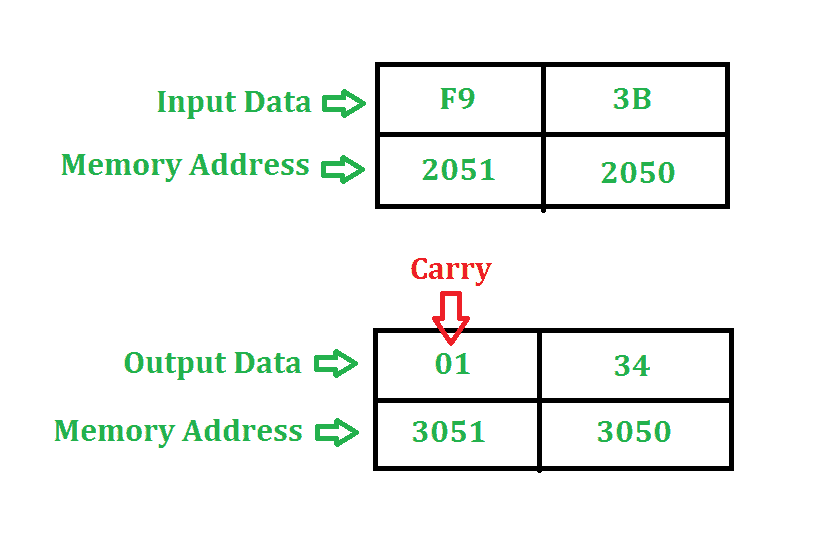

# 8085 程序添加两个 8 位数字

> 原文：[https://www.geeksforgeeks.org/assembly-language-program-8085-microprocessor-add-two-8-bit-numbers/](https://www.geeksforgeeks.org/assembly-language-program-8085-microprocessor-add-two-8-bit-numbers/)

## 问题
编写汇编语言程序，将 8085 微处理器中地址 `2050` 和地址 `2051` 存储的两个 8 位数字相加。程序的起始地址取 `2000`。

## 示例

## 算法
1. 将第一个数字从存储单元 `2050` 加载到累加器中。
2. 将累加器的内容移到寄存器 `H`。
3. 将第二个数字从内存位置 `2051` 加载到累加器。
4. 然后在 `3050` 使用 `ADD` 指令添加寄存器 `H` 和累加器的内容并存储结果。
5. 使用 `ADC` 命令恢复生成的进位，并将其存储在存储器位置 `3051`。

## 程序
| 存储地址 | 记忆术 | 评论 |
| --- | --- | --- |
| `2000` | `LDA 2050` | `A←M` |
| `2003` | `MOV H,A` | `H←A` |
| `2004` | `LDA 2051` | `A←M` |
| `2007` | `ADD H` | `A←A+H` |
| `2008` | `MOV L,A` | `L←A` |
| `2009` | `MVI A 00` | `A←01` |
| `200B` | `ADC A` | `A←A+A+carry` |
| `200C` | `MOV H,A` | `H←A` |
| `200D` | `SHLD 3050` | `L→3050, H→3051` |
| `2010` | `HLT` | 停止 |

## 解释
1. `LDA 2050` 将 `2050` 内存位置的内容移动到累加器。
2. `MOV H, A` 将累加器的内容复制到寄存器 `H`。
3. `LDA 2051` 将 `2051` 内存位置的内容移动到累加器。
4. `ADD H` 添加 `A`（累加器）和 `H` 寄存器（`F9`）的内容。结果存储在 `A` 本身。**对于所有算术指令，默认情况下，`A` 是一个操作数，`A` 也存储结果。**
5. `MOV L, A` 将 `A`（`34`）的内容复制到 `L`。
6. `MVI A 00` 将即时数据（即 `00`）移动到 `A`。
7. `ADC A` 将 `A`（`00`）的内容、指定寄存器（即 `A`）的内容和进位（`1`）相加。由于 `ADC` 也是一个算术运算，默认情况下，`A` 是一个操作数，`A` 也存储结果。
8. `MOV H, A` 将 `A`（`01`）的内容复制到 `H`。
9. `SHLD 3050` 移动 `3050` 存储单元中 `L` 寄存器（`34`）的内容和 `3051` 存储单元中 `H` 寄存器（`01`）的内容。
10. `HLT` 停止执行程序并停止任何进一步的执行。