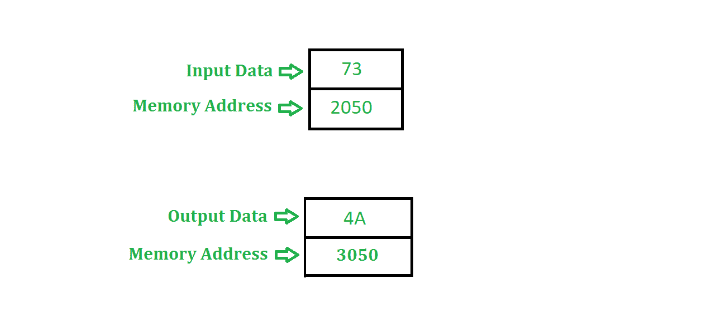

# 8085 将 8 位数字转换为灰色数字的程序

> 原文: [https://www.geeksforgeeks.org/assembly-language-program-8085-microprocessor-convert-8-bit-number-grey-number/](https://www.geeksforgeeks.org/assembly-language-program-8085-microprocessor-convert-8-bit-number-grey-number/)

先决条件 – [二进制到/自格雷码](https://www.geeksforgeeks.org/digital-logic-code-converters-binary-gray-code/)

## 问题
用 8085 编写一个汇编语言程序，将一个 8 位数字转换成格雷码。

## 示例

## 假设
8 位数字(输入)存储在存储器位置 `2050`，输出存储在存储器位置 `3050`。

## 算法
1.  在累加器中加载内存位置 `2050` 的内容。
2.  复位进位标志，即 `CY = 0`。
3.  用进位将累加器的内容向右旋转 1 位，并用输入的初始值执行异或运算。
4.  将结果存储在存储器位置 `3050`。

## 程序

| 内存地址 | 助记符 | 注释 |
| :--- | :--- | :--- |
| `2000` | `LDA 2050` | `A<-M[2050]` |
| `2003` | `MOV B, A` | `B <- A` |
| `2004` | `STC` | `CY = 1` |
| `2005` | `CMC` | `CY<-CY的补码` |
| `2006` | `RAR` | `进位向右旋转1位` |
| `2007` | `XRA B` | `A <- A 异或 B` |
| `2008` | `STA 3050` | `M[3050]<-A` |
| `200B` | `HLT` | `程序结束` |

## 解释
1.  `LDA 2050` 将内存位置 `2050` 的内容加载到累加器中。
2.  `MOV B, A` 在寄存器 `B` 中传输寄存器 `A` 的内容。
3.  `STC` 设置进位标志，即 `CY` 变为 `1`。
4.  `CMC` 补充进位标志，即 `CY` 变为 `0`。
5.  `RAR` 将累加器的内容与进位标志一起旋转 1 位。
6.  `XRA B` 在寄存器 `A` 和寄存器 `B` 的值中执行异或运算，并将结果存储在 `A` 中。
7.  `STA 3050` 将累加器的值存储在存储单元 `3050` 中。
8.  `HLT` 停止执行程序并停止任何进一步的执行。